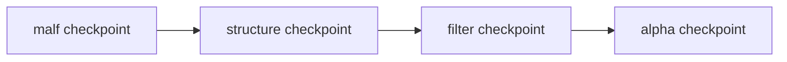

# downstream data-grade checkpoint alignment after malf

卡片编号：`35`  
日期：`2026-04-11`  
状态：`已收口`

## 需求

- 问题：canonical `malf` 已具备 `work_queue + checkpoint + tail replay`，但 `structure / filter / alpha` 仍主要依赖 bounded 窗口物化，整条下游主链尚未围绕 `malf replay` 边界完成增量化运转。
- 目标结果：让 `structure / filter / alpha` 对齐 data-grade 的 `queue / checkpoint / replay` 语义，并由 canonical `malf` source advanced 驱动下游脏单元续跑。
- 为什么现在做：如果这一层不补齐，`malf` 只能是语义中心，仍不能成为下游真实运转中心。

## 设计输入

- 设计文档：
  - `docs/01-design/modules/malf/12-downstream-data-grade-checkpoint-alignment-after-malf-charter-20260411.md`
- 规格文档：
  - `docs/02-spec/modules/malf/12-downstream-data-grade-checkpoint-alignment-after-malf-spec-20260411.md`
- 当前锚点结论：
  - `docs/03-execution/34-malf-multi-timeframe-downstream-consumption-conclusion-20260412.md`

## 续跑图

## 任务分解

1. 为 `structure / filter / alpha` 冻结稳定实体锚点、业务自然键与最小 queue/checkpoint 表族。
2. 明确 `work_queue / checkpoint / replay` 的 runner 合同，以及 `last_completed_bar_dt / tail_start_bar_dt / tail_confirm_until_dt` 等边界字段。
3. 明确下游 dirty 单元如何由 canonical `malf source advanced` 驱动挂账与续跑。
4. 补齐 replay / resume 的单测或可复现命令。
5. 回填 `35` 的 `evidence / record / conclusion` 与执行索引。

## 实现边界

- 范围内：
  - `docs/01-design/modules/malf/12-*`
  - `docs/02-spec/modules/malf/12-*`
  - `docs/03-execution/35-*`
  - `src/mlq/structure/`
  - `src/mlq/filter/`
  - `src/mlq/alpha/`
- 范围外：
  - `trade / system` live orchestration
  - 波段寿命概率 sidecar

## 历史账本约束

- 实体锚点：下游默认以 `asset_type + code + timeframe` 作为 queue/checkpoint 脏单元锚点，并继续用正式业务事件锚住快照真值。
- 业务自然键：各模块正式 `snapshot_nk / trigger_event_nk / signal_nk` 继续代表业务自然键；queue/checkpoint 只承担续跑控制，不替代业务主键。
- 批量建仓：首次 bootstrap 允许按历史窗口回填 queue/checkpoint 与对应快照账本，但必须保证后续可切换到增量续跑。
- 增量更新：日常增量由 canonical `malf source advanced` 驱动挂账，只重放受影响的下游 dirty 单元，不再默认全窗口重跑。
- 断点续跑：每个模块都必须声明 `last_completed_bar_dt / tail_start_bar_dt / tail_confirm_until_dt` 或等价边界，并保证 replay 可幂等续跑。
- 审计账本：审计继续落在各模块 `run / work_queue / checkpoint / run_bridge` 以及 `35` execution 闭环文档。

## 收口标准

1. `structure / filter / alpha` 已具备正式 `queue / checkpoint / replay` 机制，且默认无窗口运行已切到 data-grade queue 口径。
2. 有证据证明下游增量范围服从 `malf -> structure -> filter -> alpha` 的 checkpoint/fingerprint 边界，而不是回退到全窗口重跑。
3. `conclusion` 明确 `malf` 已升级为 downstream queue/fingerprint 的增量运转中心。
4. 当前执行索引已推进到 `36-malf-wave-life-probability-sidecar-bootstrap-card-20260411.md`。
