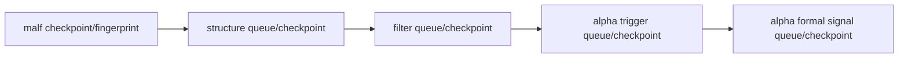

# downstream data-grade checkpoint alignment after malf 结论

日期：`2026-04-12`  
状态：`已生效`

## 结论

1. `structure / filter / alpha` 已正式补齐 `work_queue + checkpoint` 表族，并把默认无窗口运行口径切换为 data-grade queue/replay，而不是 bounded 全窗口重跑。
2. 下游脏单元已按 `asset_type + code + timeframe='D'` 对齐；`structure` 由 canonical `malf checkpoint` 驱动，`filter` 由 `structure checkpoint` 驱动，`alpha trigger` 由 `filter checkpoint + detector input` 驱动，`alpha formal signal` 由 `alpha trigger checkpoint` 驱动。
3. 各层 checkpoint 已显式落表 `last_completed_bar_dt / tail_start_bar_dt / tail_confirm_until_dt + source_fingerprint + last_run_id`，确保 replay/resume 既有边界账本，也有上游指纹对齐。
4. `run_structure_snapshot_build / run_filter_snapshot_build / run_alpha_trigger_build / run_alpha_formal_signal_build` 在显式传入 `signal_start_date / signal_end_date / instruments` 时仍保留 bounded 补跑能力；默认官方运行口径已切换到 queue 模式。
5. `alpha_trigger_event / alpha_formal_signal_event` 的 rematerialize 不再只依赖事件自然键重放，而是通过上游 checkpoint/fingerprint 变化触发 queue dirty，再在正式事件账本上完成重物化。

## 生效范围

- `src/mlq/structure/bootstrap.py`
- `src/mlq/structure/runner.py`
- `src/mlq/filter/bootstrap.py`
- `src/mlq/filter/runner.py`
- `src/mlq/alpha/bootstrap.py`
- `src/mlq/alpha/trigger_runner.py`
- `src/mlq/alpha/runner.py`
- `tests/unit/structure/test_runner.py`
- `tests/unit/filter/test_runner.py`
- `tests/unit/alpha/test_runner.py`

## 当前约束

1. 下游 queue 的正式主语义仍是 `D`；`W/M` 继续只作为 canonical read-only context，不单独扩成下游独立事件主语义。
2. `alpha trigger` 的 detector 输入尚无独立 checkpoint 表，本卡通过 `candidate min/max/count + filter checkpoint fingerprint` 驱动脏单元，不把 detector 输入直接改造成新的正式 ledger。
3. bounded 全窗口重跑仅保留为 bootstrap / 显式补跑接口，不再代表日常默认执行口径。

## 后续

1. 当前最新生效结论锚点已推进到 `35-downstream-data-grade-checkpoint-alignment-after-malf-conclusion-20260412.md`。
2. 当前待施工卡已推进到 `36-malf-wave-life-probability-sidecar-bootstrap-card-20260411.md`。
3. `100-105` 的 trade/system 恢复卡组继续顺延到 `36` 收口后再推进。

## 结论图

