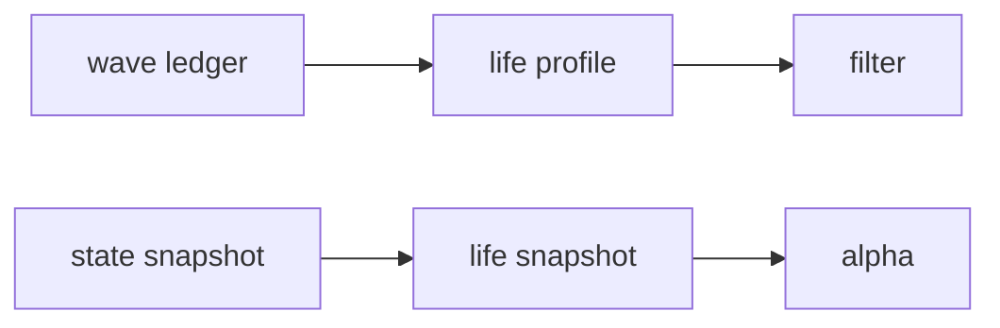

# malf wave life probability sidecar bootstrap

卡片编号：`36`
日期：`2026-04-11`
状态：`待设计`

## 需求

- 问题：
  当前 canonical `malf` 已经正式沉淀 `malf_wave_ledger / malf_state_snapshot / malf_same_level_stats`，能够回答“历史波段实际活了多久”，但还不能以正式 sidecar 形式稳定回答“当前活跃波段处于寿命分布的哪个位置、历史上类似波段通常还能活多久、终止风险是否抬升”。
- 目标结果：
  在不污染 `malf core` 的前提下，增补 `wave life probability` 只读 sidecar，形成可续跑、可复算、可审计的波段寿命概率评估层。
- 为什么现在做：
  `29-32` 已完成 canonical `malf` 收口，寿命记账账本已经成立；后续如要把“波段寿命”正式提供给 `filter / alpha` 消费，必须先把寿命概率评估器作为 `malf` sidecar 冻结下来。

## 设计输入

- 设计文档：
  - `docs/01-design/modules/malf/13-malf-wave-life-probability-sidecar-charter-20260411.md`
- 规格文档：
  - `docs/02-spec/modules/malf/13-malf-wave-life-probability-sidecar-spec-20260411.md`
- 当前锚点结论：
  - `docs/03-execution/32-downstream-truthfulness-revalidation-after-malf-canonicalization-conclusion-20260411.md`

## 分层图

## 任务分解

1. 冻结 `wave life probability` sidecar 的边界，明确它只读消费 canonical `malf`，不得反向参与 `pivot / wave / state / break / count` 计算。
2. 设计寿命快照与寿命 profile 表族，明确当前活跃波段与历史完成波段的分工。
3. 冻结“剩余寿命 / 寿命分位 / 终止风险分桶”的最小字段集。
4. 设计 batch bootstrap、日增量更新、tail replay 与 checkpoint 续跑语义。
5. 明确 `filter / alpha` 如何只读消费该 sidecar，而不是把决策动作写回 `malf`。
6. 回填 `36` 的 evidence / record / conclusion 与索引账本。

## 实现边界

- 范围内：
  - `docs/01-design/modules/malf/13-*`
  - `docs/02-spec/modules/malf/13-*`
  - `docs/03-execution/36-*`
  - `docs/03-execution/evidence/36-*`
  - `docs/03-execution/records/36-*`
  - `src/mlq/malf/` 下的寿命概率 sidecar runner 与表族
- 范围外：
  - `malf core` 原语与状态机重定义
  - 直接交易动作建议
  - `filter / alpha / trade` 的正式消费策略实现

## 历史账本约束

- 实体锚点：
  - 明细快照以 `asset_type + code + timeframe` 为实体锚点。
  - 聚合 profile 以 `timeframe + major_state + reversal_stage + sample_version` 为统计锚点。
- 业务自然键：
  - `malf_wave_life_snapshot` 建议使用 `asset_type + code + timeframe + asof_bar_dt`
  - `malf_wave_life_profile` 建议使用 `timeframe + major_state + reversal_stage + metric_name + sample_version`
- 批量建仓：
  - 首次从 canonical `malf_wave_ledger / malf_state_snapshot / malf_same_level_stats` 全历史回放起建。
  - 只读消费 canonical `malf` 正式表，不回读 bridge v1，不回写 `malf core`。
- 增量更新：
  - 每日仅对 source advanced 的 `asset_type + code + timeframe` 重算尾部。
  - 已完成 wave 的统计样本只追加；活跃 wave 的寿命快照只更新最新窗口。
- 断点续跑：
  - 必须具备独立 `work_queue + checkpoint + tail replay`。
  - checkpoint 至少声明 `last_completed_bar_dt / tail_start_bar_dt / tail_confirm_until_dt / last_sample_version`。
- 审计账本：
  - 至少落 `malf_wave_life_run / malf_wave_life_work_queue / malf_wave_life_checkpoint / malf_wave_life_snapshot`
  - 如 profile 单独落表，再加 `malf_wave_life_profile`
  - `run_id` 只做审计，不充当业务真值主键。

## 收口标准

1. `wave life probability` sidecar 的正式边界与表族被冻结。
2. 波段寿命快照与历史寿命 profile 可以按 batch + increment + resume 正式运行。
3. `malf core` 与寿命概率 sidecar 的读写边界可审计、可复算。
4. `filter / alpha` 获得正式可读的寿命分位或终止风险输入，但不把动作逻辑回写到 `malf`。
