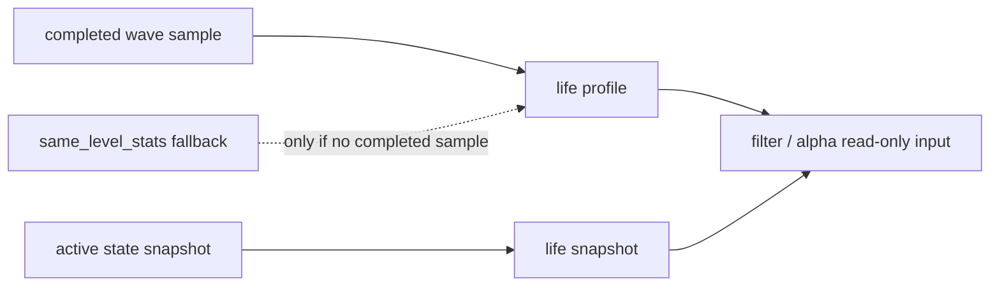

# malf wave life probability sidecar bootstrap 结论

日期：`2026-04-12`  
状态：`已生效`

## 结论

1. `malf_wave_life_run / malf_wave_life_work_queue / malf_wave_life_checkpoint / malf_wave_life_snapshot / malf_wave_life_profile` 已正式落表，`wave life probability` 被冻结为 canonical `malf` 之外的只读 sidecar，不回写 `pivot / wave / state / break / count`。
2. `run_malf_wave_life_build` 在显式传入 `signal_start_date / signal_end_date / instruments` 时走 bounded window 补跑；默认无窗口调用时改为消费 `malf_canonical_checkpoint` 并进入 data-grade `work_queue + checkpoint + tail replay` 续跑口径。
3. `malf_wave_life_profile` 只用已完成 wave 的寿命样本建模；`malf_wave_life_snapshot` 只面向 asof 时点的活跃 wave 计算 `wave_life_percentile / remaining_life_bars_p50 / remaining_life_bars_p75 / termination_risk_bucket`，正式把“完成样本”和“活跃快照”分开。
4. 当某个 `timeframe + major_state + reversal_stage` 组别尚无 completed wave 样本时，runner 允许只读回退到 canonical `malf_same_level_stats(metric_name='wave_duration_bars')`，但该回退只补 profile/snapshot 可读性，不改变 `malf core` 真值。
5. queue dirty 现已显式对齐 `source_fingerprint + last_sample_version`；canonical `malf` 的 checkpoint/run replay 变化会触发寿命 sidecar requeue/rematerialize。

## 生效范围

- `src/mlq/malf/bootstrap.py`
- `src/mlq/malf/wave_life_runner.py`
- `src/mlq/malf/__init__.py`
- `scripts/malf/run_malf_wave_life_build.py`
- `tests/unit/malf/test_wave_life_runner.py`

## 当前约束

1. 当前 profile 的正式 `metric_name` 只冻结为 `wave_duration_bars`；尚未扩展更多寿命相关统计指标。
2. 当前 run 会全量刷新所选 timeframe 的 profile，但 snapshot 只对被 claim 的 `asset_type + code + timeframe` replay 窗口重算；其他 scope 需等待自身下一次 replay 才会看到更新后的 percentile。
3. `filter / alpha` 在本卡后只获得正式可读 sidecar 输入，但本卡不越界改写它们的正式消费策略或字段对接。

## 后续

1. 当前最新生效结论锚点已推进到 `36-malf-wave-life-probability-sidecar-bootstrap-conclusion-20260412.md`。
2. 当前待施工卡切换到 `100-trade-signal-anchor-contract-freeze-card-20260411.md`。
3. `36` 已收口，`100-105` 的 trade/system 恢复卡组恢复为当前正式后续主线。

## 结论图

