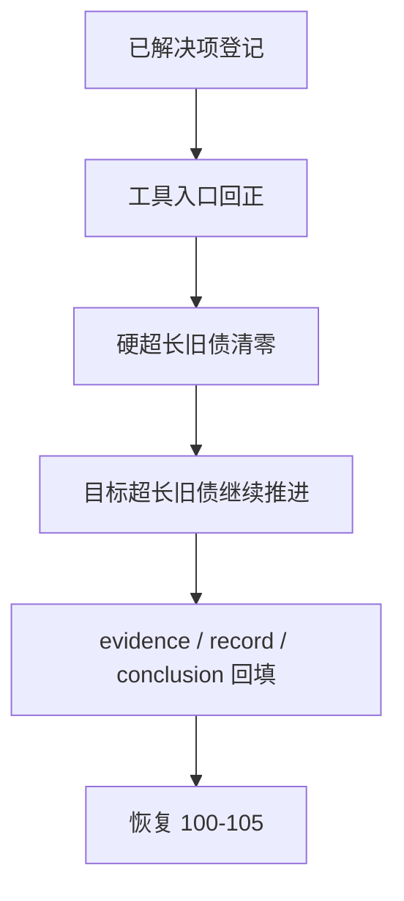

# system governance historical debt backlog burndown

卡片编号：`37`
日期：`2026-04-12`
状态：`已完成`

## 需求
- 问题：
  `1-37` 主线已完成并收口，全仓治理扫描不应再残留历史超长旧债；如果继续把这些问题留在隐式白名单里，治理文档、设计文档、代码、测试和工具之间会持续失配。
- 目标结果：
  用一张正式治理卡把“已解决项登记 + 剩余历史债务持续清零 + 工具入口回正”统一收口，并让 `development_governance_legacy_backlog.py` 成为唯一可信台账。
- 为什么现在做：
  `29-37` 已完成生效，`100-105` 已恢复为当前 trade/system 推进卡组；先把治理噪音清干净，后续主线才能稳定继续。

## 设计输入
- `docs/01-design/modules/system/11-governance-historical-debt-backlog-burndown-charter-20260412.md`
- `docs/02-spec/modules/system/11-governance-historical-debt-backlog-burndown-spec-20260412.md`
- `docs/03-execution/36-malf-wave-life-probability-sidecar-bootstrap-conclusion-20260412.md`

## 任务分解
1. 登记 2026-04-12 已解决的治理纠偏项，补齐 `37` 基线台账。
2. 修正治理工具和执行脚手架，使开卡、索引回填、全仓盘点与当前执行目录口径一致。
3. 清零 `LEGACY_HARD_OVERSIZE_BACKLOG`。
4. 继续按顺序收敛 `LEGACY_TARGET_OVERSIZE_BACKLOG`。
5. 回填 `37` 的 evidence / record / conclusion，并为 `100-105` 让路。

## 已解决项
1. `src/mlq/malf/wave_life_runner.py` 已拆分为 runner + helper 模块。
2. `scripts/portfolio_plan/run_portfolio_plan_build.py`、`scripts/trade/run_trade_runtime_build.py`、`scripts/system/run_system_mainline_readout_build.py` 与对应测试已补齐中文治理锚点。
3. `scripts/system/development_governance_legacy_backlog.py` 已从占位文件改为正式历史债务登记表。
4. `AGENTS.md / README.md / pyproject.toml` 已同步 wave life 拆分约束和 backlog 登记口径。
5. `.codex/skills/lifespan-execution-discipline/scripts/new_execution_bundle.py` 已修正模板编号与索引同步逻辑。
6. `src/mlq/system/runner.py` 已拆分为 bounded orchestrator + `readout_shared / readout_children / readout_snapshot / readout_materialization`。
7. `src/mlq/trade/runner.py` 已拆分为 bounded orchestrator + `runtime_shared / runtime_source / runtime_execution / runtime_materialization`。
8. `src/mlq/alpha/trigger_runner.py` 已拆分为 bounded orchestrator + `trigger_shared / trigger_sources / trigger_materialization`。
9. `src/mlq/filter/runner.py` 已拆分为 bounded orchestrator + `filter_shared / filter_source / filter_materialization`。
10. `src/mlq/malf/mechanism_runner.py` 已拆分为 bounded orchestrator + `mechanism_shared / mechanism_source / mechanism_materialization`。
11. `src/mlq/malf/canonical_runner.py` 已拆分为 bounded orchestrator + `canonical_shared / canonical_source / canonical_materialization`。
12. `src/mlq/structure/runner.py` 已拆分为 bounded orchestrator + `structure_shared / structure_source / structure_query / structure_materialization`。
13. `src/mlq/alpha/runner.py` 已拆分为 bounded orchestrator + `formal_signal_shared / formal_signal_source / formal_signal_materialization`。
14. `src/mlq/data/runner.py` 已拆分为 formal orchestrator + `data_shared / data_common / data_raw_support / data_raw_runner / data_tdxquant / data_market_base_scope / data_market_base_materialization / data_market_base_runner`。
15. `tests/unit/data/test_data_runner.py` 已拆分为 `test_raw_ingest_runner.py / test_tdxquant_runner.py / test_market_base_runner.py`。
16. `src/mlq/data/bootstrap.py` 已抽出 `data_bootstrap_maintenance.py`，正式入口、路径契约、DDL 和 cleanup 行为保持不变，并已跌回目标线内。
17. `src/mlq/malf/runner.py` 已拆分为 bridge v1 bounded orchestrator + `snapshot_shared / snapshot_source / snapshot_materialization`，外部脚本入口与 bridge v1 表族契约保持不变。
18. `src/mlq/malf/bootstrap.py` 已拆分为 facade + `bootstrap_tables / bootstrap_columns`，对外导出的表名常量、bootstrap/连接/path 入口与表族语义保持不变。

## 当前债务台账
1. `LEGACY_HARD_OVERSIZE_BACKLOG`
- 已清零。
2. `LEGACY_TARGET_OVERSIZE_BACKLOG`
- 已清零。

## 实现边界
- 范围内：
  - `docs/03-execution/37-*`
  - `docs/03-execution/evidence/37-*`
  - `docs/03-execution/records/37-*`
  - `scripts/system/development_governance_legacy_backlog.py`
  - 被纳入 backlog 的历史超长文件与对应测试
- 范围外：
  - `100-105` 的业务目标改写
  - 新增 live/runtime 语义
  - 为了过检查继续引入新的长期白名单

## 历史账本约束
- 实体锚点：`debt_type + path`
- 业务自然键：
  每一项治理债务都以 `debt_type + path` 唯一标识；是否已解决由 execution 文档与 backlog 台账共同声明。
- 批量建仓：
  首次以全仓治理扫描结果为基线，完整登记已解决项和剩余项。
- 增量更新：
  后续每解决一项债务，只允许按自然键从 backlog 移除并同步补写 evidence / record / conclusion。
- 断点续跑：
  任一阶段中断后，允许按当前台账继续推进，不得重新引入已清零项。
- 审计账本：
  审计落在 `scripts/system/development_governance_legacy_backlog.py` 与 `37` 的 card / evidence / record / conclusion。

## 收口标准
1. `LEGACY_HARD_OVERSIZE_BACKLOG` 清零并保持为零。
2. 全仓 `python scripts/system/check_development_governance.py` 不再依赖历史 hard backlog 掩盖旧问题。
3. `37` 完整回填 evidence / record / conclusion，并持续登记每一轮清债结果。
4. `LEGACY_TARGET_OVERSIZE_BACKLOG` 已清零，`37` 的历史超长治理目标已全部收口。

## 当前进度
1. 基线登记、工具纠偏、hard backlog 清零已经完成。
2. 当前剩余治理债务已清零。
3. 下一步应从 `37` 切回 `100-105` 的 trade/system 主线推进。

## 卡片结构图

