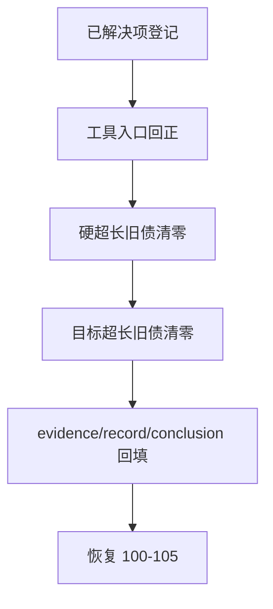

# system governance historical debt backlog burndown

卡片编号：`37`
日期：`2026-04-12`
状态：`执行中`

## 需求

- 问题：
  `1-36` 主线已经完成，但全仓治理扫描仍有历史超长旧债和治理工具旧债；如果继续把这些问题留在 backlog 白名单里，治理文档、设计文档、代码、测试和工具之间会持续失配。
- 目标结果：
  用一张正式治理卡把“已解决项登记 + 剩余历史债务清零 + 工具入口回正”一次性收口，并在 `37` 完成后把 `development_governance_legacy_backlog.py` 收敛为全空台账。
- 为什么现在做：
  当前 `36` 已成为最新生效锚点，`100-105` 还未继续推进；此时先把治理旧债清干净，后续 trade/system 恢复卡组才不会持续被治理噪音打断。

## 设计输入

- 设计文档：
  - `docs/01-design/modules/system/11-governance-historical-debt-backlog-burndown-charter-20260412.md`
- 规格文档：
  - `docs/02-spec/modules/system/11-governance-historical-debt-backlog-burndown-spec-20260412.md`
- 当前锚点结论：
  - `docs/03-execution/36-malf-wave-life-probability-sidecar-bootstrap-conclusion-20260412.md`

## 任务分解

1. 登记 2026-04-12 已解决的首批治理纠偏项，补齐 `37` 的基线台账。
2. 修正治理工具和执行脚手架，使开卡、索引回填、全仓盘点与当前执行目录口径一致。
3. 逐项清零 `LEGACY_HARD_OVERSIZE_BACKLOG`。
4. 逐项清零 `LEGACY_TARGET_OVERSIZE_BACKLOG`。
5. 回填 `37` 的 evidence / record / conclusion，并把 `100-105` 恢复为下一阶段 trade/system 卡组。

## 当前债务台账

### 已登记已解决项

1. `src/mlq/malf/wave_life_runner.py` 已拆分为 runner + helper 模块，移除新增硬超长违规。
2. `scripts/portfolio_plan/run_portfolio_plan_build.py`、`scripts/trade/run_trade_runtime_build.py`、`scripts/system/run_system_mainline_readout_build.py` 及对应测试已补齐中文治理要求。
3. `scripts/system/development_governance_legacy_backlog.py` 已从空白占位改为正式历史债务登记表。
4. `AGENTS.md / README.md / pyproject.toml` 已同步 wave life 拆分约束和 backlog 登记口径。
5. `.codex/skills/lifespan-execution-discipline/scripts/new_execution_bundle.py` 已修正模板编号渲染与目录分栏标题错误。
6. `src/mlq/system/runner.py` 已拆分为 bounded orchestrator + readout helper 模块，并通过现有 `system` 单测验证，可以从历史超长白名单移除。
7. `src/mlq/trade/runner.py` 已拆分为 bounded orchestrator + runtime helper 模块，并通过现有 `trade` 单测验证，可以从历史超长白名单移除。
8. `src/mlq/alpha/trigger_runner.py` 已拆分为 queue/bounded orchestrator + trigger helper 模块，并通过现有 `alpha` 单测验证，可以从历史超长白名单移除。
9. `src/mlq/filter/runner.py` 已拆分为 bounded/queue orchestrator + `filter_shared / filter_source / filter_materialization` helper 模块，并通过现有 `filter` 单测验证，可以从历史超长白名单移除。
10. `src/mlq/malf/mechanism_runner.py` 已拆分为 bounded orchestrator + `mechanism_shared / mechanism_source / mechanism_materialization` helper 模块，并通过现有 `malf mechanism` 单测验证，可以从历史超长白名单移除。

### 待解决历史债务

1. `LEGACY_HARD_OVERSIZE_BACKLOG`
  - `src/mlq/alpha/runner.py`
  - `src/mlq/data/runner.py`
  - `src/mlq/malf/canonical_runner.py`
  - `src/mlq/structure/runner.py`
  - `tests/unit/data/test_data_runner.py`
2. `LEGACY_TARGET_OVERSIZE_BACKLOG`
   - `src/mlq/alpha/family_runner.py`
   - `src/mlq/data/bootstrap.py`
   - `src/mlq/malf/bootstrap.py`
   - `src/mlq/malf/runner.py`
   - `src/mlq/position/bootstrap.py`

## 实现边界

- 范围内：
  - `docs/01-design/modules/system/11-*`
  - `docs/02-spec/modules/system/11-*`
  - `docs/03-execution/37-*`
  - `docs/03-execution/evidence/37-*`
  - `docs/03-execution/records/37-*`
  - `scripts/system/development_governance_legacy_backlog.py`
  - `.codex/skills/lifespan-execution-discipline/scripts/new_execution_bundle.py`
  - 被纳入 backlog 的超长文件与对应测试
- 范围外：
  - `100-105` 的业务目标改写
  - 新增 live/runtime 语义
  - 为了“通过检查”而引入新的长期白名单

## 历史账本约束

- 实体锚点：
  `debt_type + path`
- 业务自然键：
  每一项治理债务以 `debt_type + path` 唯一标识；是否已解决由 execution 文档和 backlog 文件共同声明，`run_id` 不参与主语义。
- 批量建仓：
  首次以全仓治理扫描结果为基线，完整登记已解决项和剩余项。
- 增量更新：
  后续每解决一项债务，只允许按自然键从 backlog 移除并同步补写 evidence / record / conclusion。
- 断点续跑：
  任一阶段中断后，允许按债务类别和路径从 `37` 当前台账继续推进，不得重新引入已清零项。
- 审计账本：
  审计落在 `scripts/system/development_governance_legacy_backlog.py` 与 `37` 的 card / evidence / record / conclusion。

## 收口标准

1. `LEGACY_HARD_OVERSIZE_BACKLOG` 与 `LEGACY_TARGET_OVERSIZE_BACKLOG` 清零。
2. 全仓 `python scripts/system/check_development_governance.py` 不再依赖历史债务条目掩盖旧问题。
3. `37` 完整回填 evidence / record / conclusion，并明确登记本轮已解决项。
4. `100-105` 恢复为治理清债后的后续 trade/system 卡组。

## 当前进度

1. 已完成首批基线登记与工具纠偏。
2. 已完成 `src/mlq/system/runner.py` 拆分，当前正式入口仍保持不变，新增 `readout_shared / readout_children / readout_snapshot / readout_materialization` 四个 helper 模块承接子职责。
3. 已完成 `src/mlq/trade/runner.py` 拆分，当前正式入口仍保持不变，新增 `runtime_shared / runtime_source / runtime_execution / runtime_materialization` 四个 helper 模块承接共享结构、上游读取、执行聚合与落表写回职责。
4. 已完成 `src/mlq/alpha/trigger_runner.py` 拆分，当前正式入口仍保持不变，新增 `trigger_shared / trigger_sources / trigger_materialization` 三个 helper 模块承接共享结构、上游读取与事件物化职责。
5. 已完成 `src/mlq/filter/runner.py` 拆分，当前正式入口仍保持不变，新增 `filter_shared / filter_source / filter_materialization` 三个 helper 模块承接共享结构、上游读取与落表物化职责。
6. 已完成 `src/mlq/malf/mechanism_runner.py` 拆分，当前正式入口仍保持不变，新增 `mechanism_shared / mechanism_source / mechanism_materialization` 三个 helper 模块承接共享结构、桥接输入读取与 sidecar 落表职责。
7. 后续继续按 `LEGACY_HARD_OVERSIZE_BACKLOG` 顺序清理剩余历史债务。

## 卡片结构图

