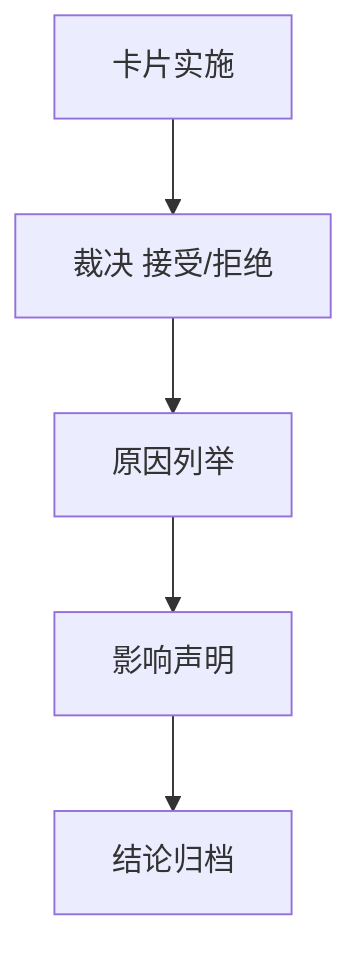

# system governance historical debt backlog burndown 结论

结论编号：`37`
日期：`2026-04-12`
状态：`执行中`

## 裁决

- 接受：
  将 `37` 设为当前治理债务总卡，统一收口历史治理 backlog，并登记 2026-04-12 已完成的首批纠偏项。
- 拒绝：
  继续把历史债务仅保留在隐性白名单或口头状态里，不做正式 execution 登记。
- 当前进度：
  `src/mlq/system/runner.py`、`src/mlq/trade/runner.py`、`src/mlq/alpha/trigger_runner.py`、`src/mlq/filter/runner.py`、`src/mlq/malf/mechanism_runner.py`、`src/mlq/malf/canonical_runner.py` 与 `src/mlq/structure/runner.py` 已完成拆分并从 `LEGACY_HARD_OVERSIZE_BACKLOG` 移除；`37` 其余历史债务继续按台账顺序推进。

## 原因

- 全仓治理扫描已经能够稳定识别剩余旧债，具备正式清账条件。
- 本轮已完成的纠偏项如果不登记在册，后续无法证明历史债务确实被收敛。

## 影响

- 当前待施工卡切换为 `37-system-governance-historical-debt-backlog-burndown-card-20260412.md`。
- `100-105` 顺延为 `37` 之后的 trade/system 恢复卡组。
- 最新生效结论锚点仍保持为 `36-malf-wave-life-probability-sidecar-bootstrap-conclusion-20260412.md`，直到 `37` 实际收口完成。
- 当前历史硬超长 backlog 已从 `10` 项降为 `3` 项。

## 结论结构图

