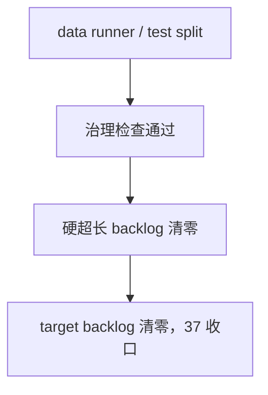

# system governance historical debt backlog burndown 结论

结论编号：`37`
日期：`2026-04-12`
状态：`执行中`

## 裁决
- 接受：
  `src/mlq/data/runner.py` 与 `tests/unit/data/test_data_runner.py` 已完成拆分并通过治理校验与串行单测，可以从 `LEGACY_HARD_OVERSIZE_BACKLOG` 移除。
- 保留：
  `src/mlq/data/bootstrap.py`、`src/mlq/malf/runner.py`、`src/mlq/malf/bootstrap.py`、`src/mlq/alpha/family_runner.py` 与 `src/mlq/position/bootstrap.py` 已通过 helper 拆分跌回目标线内，可以从 `LEGACY_TARGET_OVERSIZE_BACKLOG` 移除；当前 target backlog 已清零，`37` 的历史超长治理目标全部收口。

## 原因
- `data` 这轮拆分保持了外部正式入口、账本表族契约与测试行为不变，只把内部职责按 raw ingest / TdxQuant / market_base / test suites 收敛进 helper 模块。
- 改动路径治理检查与串行 pytest 已能证明这两项历史 hard backlog 不再需要白名单豁免。

## 影响
- 历史 hard oversize backlog 已从 `10` 项降为 `0` 项。
- 当前 `LEGACY_TARGET_OVERSIZE_BACKLOG` 已清零。
- `100-105` 仍维持为治理清债之后恢复推进的 trade/system 卡组。

## 结论结构图

