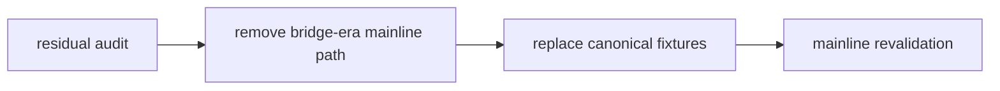

# structure filter 主线旧版 malf 语义清理

卡片编号：`38`
日期：`2026-04-13`
状态：`已完成`

## 需求

- 问题：
  `31/33/35/36` 虽已完成 canonical rebind、purge、checkpoint 对齐与寿命 sidecar 落位，但 `structure / filter` 主线代码仍残留 bridge-era 读取分支、旧语义映射与旧测试夹具，主线真值仍存在被显式参数或遗留测试重新拖回旧口径的风险。
- 目标结果：
  把 `structure / filter` 主线 runner、共享逻辑与主线测试彻底清理到 canonical-only 口径。
- 为什么现在做：
  按当前主线要求，必须先把 `structure / filter` 清干净，后续才允许进入 `alpha` 的 `PAS 5` 扩编。

## 设计输入

- 设计文档：
  - `docs/01-design/modules/malf/14-structure-filter-mainline-legacy-malf-semantic-purge-charter-20260413.md`
- 规格文档：
  - `docs/02-spec/modules/malf/14-structure-filter-mainline-legacy-malf-semantic-purge-spec-20260413.md`
- 当前锚点结论：
  - `docs/03-execution/37-system-governance-historical-debt-backlog-burndown-conclusion-20260412.md`

## 任务分解

1. 盘点 `structure / filter` 主线代码中的 bridge-era loader、旧语义映射与兼容参数入口。
2. 移除主线 runner 中对 `pas_context_snapshot / structure_candidate_snapshot` 的可执行依赖。
3. 把 `tests/unit/structure`、`tests/unit/filter`、相关 `system` 主线测试改成 canonical 夹具。
4. 复核 `structure -> filter -> alpha` 主线 truthfulness 与 queue/checkpoint 不被破坏。

## 卡片结构图

## 实现边界

- 范围内：
  - `docs/01-design/modules/malf/14-*`
  - `docs/02-spec/modules/malf/14-*`
  - `docs/03-execution/38-*`
  - `docs/03-execution/evidence/38-*`
  - `docs/03-execution/records/38-*`
  - `src/mlq/structure/*`
  - `src/mlq/filter/*`
  - `scripts/structure/*`
  - `scripts/filter/*`
  - `tests/unit/structure/*`
  - `tests/unit/filter/*`
  - 直接依赖它们的 `tests/unit/system/*`
- 范围外：
  - `alpha PAS 5` 扩编
  - 本地库标准化与迁移
  - `100-105` trade/system 卡组

## 历史账本约束

- 实体锚点：`asset_type + code`
- 业务自然键：
  `structure_snapshot_nk / filter_snapshot_nk / asset_type + code + timeframe checkpoint`
- 批量建仓：
  允许按 canonical bounded window 重建 `structure / filter` 历史区间
- 增量更新：
  默认继续走 `work_queue + checkpoint + tail replay`
- 断点续跑：
  依赖 `last_completed_bar_dt / tail_* / source_fingerprint`
- 审计账本：
  `structure_run / structure_run_snapshot / structure_checkpoint / structure_work_queue`
  与
  `filter_run / filter_run_snapshot / filter_checkpoint / filter_work_queue`

## 收口标准

1. `structure / filter` 主线代码不再接受 bridge-era 表作为正式输入
2. 主线测试夹具切换为 canonical `malf_state_snapshot`
3. 主线 truthfulness 回归通过
4. `38` 的 evidence / record / conclusion 写完
