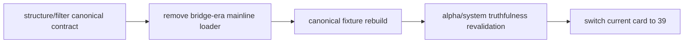

# structure filter 主线旧版 malf 语义清理结论

结论编号：`38`
日期：`2026-04-13`
状态：`已完成`

## 裁决

- 接受：`structure / filter` 主线已经完成 canonical `malf` 语义清理
- 接受：主线运行路径不再接受 `pas_context_snapshot / structure_candidate_snapshot` 作为正式输入
- 接受：`alpha / system` 主线上游测试夹具已同步迁移到 canonical `malf_state_snapshot`

## 原因

- `structure` 与 `filter` runner 已增加显式 mainline contract 校验，旧版 bridge 表名无法再作为正式参数透传
- `structure_source.py` 已移除主线 bridge-era input/context loader 与 legacy context 映射，官方主线只剩 canonical 读取路径
- `structure / filter / alpha / system` 相关单测已完成 canonical fixture 重建，并通过串行回归

## 影响

- `38` 已正式收口，`39-mainline-local-ledger-standardization-bootstrap-card-20260413.md` 成为新的当前待施工卡
- 主线语义前置已净化完毕，后续可以在不回踩旧语义的前提下推进本地正式库标准化与增量续跑
- `100-105` 继续顺延，等待 `39 -> 40` 完成后恢复

## 结论结构图

