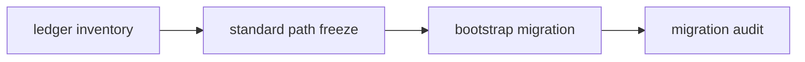

# 主线本地账本标准化 bootstrap

卡片编号：`39`
日期：`2026-04-13`
状态：`已完成`

## 需求

- 问题：
  主线永续化本地库虽然已各自成形，但尚未以 `data` 模块为标准完成统一的标准库清单、正式路径口径和存量迁移制度。
- 目标结果：
  冻结主线标准库清单，完成首轮存量迁移方案与 bootstrap 入口。
- 为什么现在做：
  在 `alpha / position / trade / system` 继续加厚前，先把本地账本标准化，否则后续主线会继续积累影子库和不可复算状态。

## 设计输入

- 设计文档：
  - `docs/01-design/modules/data/06-mainline-local-ledger-standardization-charter-20260413.md`
- 规格文档：
  - `docs/02-spec/modules/data/06-mainline-local-ledger-standardization-spec-20260413.md`
- 前置卡：
  - `docs/03-execution/38-structure-filter-mainline-legacy-malf-semantic-purge-card-20260413.md`

## 任务分解

1. 盘点主线正式永续库与当前落盘位置。
2. 冻结标准库清单、正式路径、临时路径与迁移批次方案。
3. 为至少一条主线链路补齐存量批量迁移入口与对账方式。

## 任务结构图

## 实现边界

- 范围内：
  - `docs/01-design/modules/data/06-*`
  - `docs/02-spec/modules/data/06-*`
  - `docs/03-execution/39-*`
  - `docs/03-execution/evidence/39-*`
  - `docs/03-execution/records/39-*`
  - 主线正式库 inventory / bootstrap migration 相关实现
- 范围外：
  - 每日增量同步自动化
  - `alpha PAS 5`
  - `100-105`

## 历史账本约束

- 实体锚点：`asset_type + code`
- 业务自然键：
  `ledger_name + module NK` 与 `asset_type + code(+timeframe)`
- 批量建仓：
  通过分批迁移完成一次性标准化入库
- 增量更新：
  本卡只冻结入口与清单，不负责日更自动化
- 断点续跑：
  迁移过程也必须保留 checkpoint / batch progress
- 审计账本：
  迁移 run、批次 readout、对账摘要

## 收口标准

1. 主线正式库清单与标准路径冻结
2. 存量迁移 bootstrap 入口成立
3. 至少一条链路完成迁移演练证据
4. `39` 的 evidence / record / conclusion 写完
