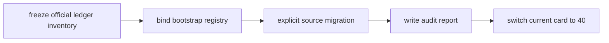

# 主线本地账本标准化 bootstrap 结论

结论编号：`39`
日期：`2026-04-13`
状态：`已完成`

## 裁决

- 接受：主线正式 ledger 清单与官方目标路径已经冻结
- 接受：一次性标准化 bootstrap 入口已经建立
- 接受：至少一条主线 ledger 迁移演练已经通过

## 原因

- `data_mainline_standardization` 已把 `10` 个主线正式库统一纳入标准化 registry
- runner 明确绑定官方目标路径与各模块 bootstrap 入口，迁移后会重新补齐正式 schema
- `structure` legacy source 迁移演练已证明：显式源库可以复制到官方标准库，并保留正式落表事实

## 影响

- `39` 正式收口，当前待施工卡切换到 `40-mainline-local-ledger-incremental-sync-and-resume-card-20260413.md`
- 后续增量同步不再建立在散乱 shadow DB 之上，而是建立在已冻结的官方标准库清单之上
- `100-105` 继续顺延，等待 `40` 完成断点续跑闭环后恢复

## 结论结构图

