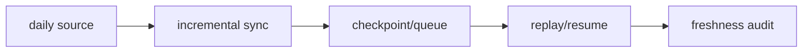

# 主线本地账本增量同步与断点续跑

卡片编号：`40`
日期：`2026-04-13`
状态：`草稿`

## 需求

- 问题：
  仅完成标准化 bootstrap 还不够，主线正式库必须形成每日增量更新与断点续跑制度，否则标准库会很快失去新鲜度。
- 目标结果：
  为主线正式库建立日更、checkpoint、dirty queue、replay 与新鲜度审计。
- 为什么现在做：
  这是把“本地标准库”变成“可长期运行账本”的必要闭环。

## 设计输入

- 设计文档：
  - `docs/01-design/modules/data/06-mainline-local-ledger-standardization-charter-20260413.md`
- 规格文档：
  - `docs/02-spec/modules/data/06-mainline-local-ledger-standardization-spec-20260413.md`
- 前置卡：
  - `docs/03-execution/39-mainline-local-ledger-standardization-bootstrap-card-20260413.md`

## 任务分解

1. 冻结每日增量输入来源与同步顺序。
2. 补齐 checkpoint / dirty queue / replay / last freshness readout。
3. 为至少一条主线链路跑通增量同步与断点恢复证据。

## 任务结构图

## 实现边界

- 范围内：
  - `docs/03-execution/40-*`
  - `docs/03-execution/evidence/40-*`
  - `docs/03-execution/records/40-*`
  - 主线正式库日更与断点续跑相关实现
- 范围外：
  - `alpha PAS 5`
  - `100-105`

## 历史账本约束

- 实体锚点：`asset_type + code`
- 业务自然键：
  `asset_type + code(+timeframe)` 与模块正式 NK
- 批量建仓：
  依赖 `39` 已完成的标准化 bootstrap
- 增量更新：
  默认按日更批次推进
- 断点续跑：
  必须显式落表 `last_completed_bar_dt / tail_* / source_fingerprint`
- 审计账本：
  日更 run、checkpoint、queue、freshness readout

## 收口标准

1. 主线正式库日更入口成立
2. 至少一条链路支持 checkpoint / replay / resume
3. 有新鲜度审计摘要
4. `40` 的 evidence / record / conclusion 写完
