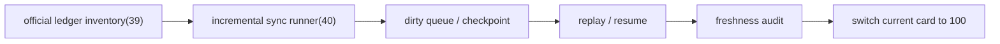

# 主线本地账本增量同步与断点续跑结论

结论编号：`40`
日期：`2026-04-13`
状态：`已完成`

## 裁决

- 接受：主线官方 ledger 已具备每日增量同步入口
- 接受：`checkpoint / dirty queue / replay / freshness audit` 已形成正式控制账本闭环
- 接受：至少一条主线链路的原地续跑、外部 source 推进同步和显式 replay 已完成可复现演练

## 原因

- `data_mainline_incremental_sync` 已把 `40` 的控制账本固定为 `run / checkpoint / dirty_queue / freshness_readout`
- runner 同时支持：
  - 官方 target 原地观察续跑
  - legacy source -> official target 的复制同步
  - 显式 replay 覆盖 tail checkpoint
- freshness audit 已改为只读官方 ledger 的业务主日期列，不再让审计时间戳污染最新 bar 判断

## 影响

- `40` 正式收口，当前待施工卡切回 `100-trade-signal-anchor-contract-freeze-card-20260411.md`
- `39` 冻结的官方 ledger 清单现在不再只是一次性建仓方案，而是具备持续续跑能力的正式本地账本
- 后续 `trade/system` 卡组可以直接消费这套标准化后的 data-grade 本地 ledger 治理语义

## 结论结构图

