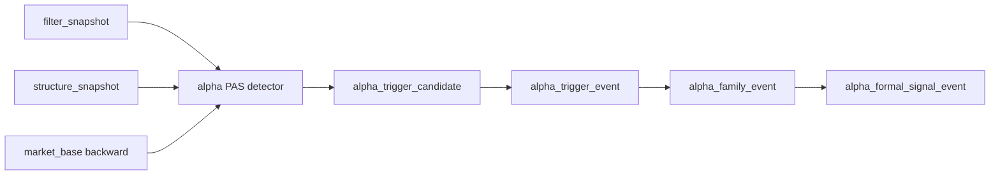

# 41-alpha-pas-five-trigger-canonical-detector 结论
更新时间 `2026-04-13`
状态 `已完成`

## 结论

- 接受：`alpha` 已补齐官方 PAS 五触发 detector，`alpha_trigger_candidate` 不再依赖测试注入或手工写表。
- 接受：新 detector 已严格绑定 canonical 主线输入：
  - `filter_snapshot`
  - `structure_snapshot`
  - `market_base.stock_daily_adjusted(adjust_method='backward')`
- 接受：`bof / tst / pb / cpb / bpb` 五触发已进入官方 runner，并能无缝衔接现有 `trigger / family / formal signal` 链路。

## 收口范围

1. 新增 `alpha_pas_trigger_*` 账本表族
2. 正式化 `alpha_trigger_candidate` 的官方 producer 身份
3. 五触发 detector 逻辑落地到主线新语义
4. queue / checkpoint / replay 与 `filter_checkpoint` 对齐
5. downstream trigger/family/system 回归通过

## 未在本卡内处理的事项

1. `alpha_formal_signal_event` 中的 compat-only 列仍保留
   - 这是 `100+` 之前后续 alpha/trade 合同卡处理的内容

2. 全仓历史治理债务
   - `src/mlq/data/data_mainline_incremental_sync.py (1013 行)` 仍使 `check_development_governance.py` 的全仓盘点返回非零
   - 本卡未新增相关债务

## 下一步

- `41` 已完成官方 PAS detector 收口。
- 进入下一张 alpha 卡之前，需先定义 `42+` 的正式文档与施工位；在那之前，仓库当前待施工位仍保持在 `41`。

