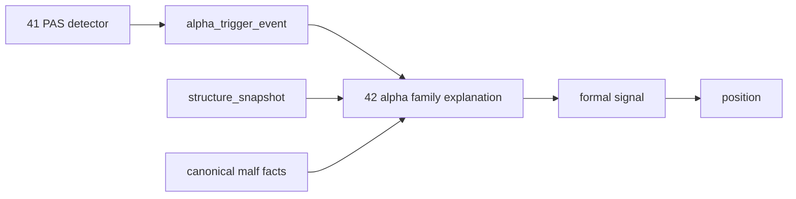

# 42-alpha-family-role-and-malf-alignment
`日期：2026-04-13`
`状态：已完成`

## 需求

- 问题：`41` 已经补齐 PAS 五触发 canonical detector，但主线只有“候选事实”，还没有“家族解释真值”；当前 `alpha / position` 仍在过渡消费 compat-only 的 `malf_context_4 / lifecycle_rank_*`。
- 目标结果：冻结 PAS 五触发的 family role，冻结 `malf_alignment / malf_phase_bucket / family_bias` 等正式解释键，让 `41` 产生的官方 detector 输出无缝进入新的 family ledger。
- 为什么现在做：`100` 之前如果不先冻结 `alpha family` 的正式角色与 `malf` 协同语义，后面的 signal anchor 仍然会漂。

## 设计输入

- `docs/01-design/` 设计文档链接
  - `docs/01-design/modules/alpha/04-alpha-pas-five-trigger-canonical-detector-charter-20260413.md`
  - `docs/01-design/modules/alpha/05-alpha-family-role-and-malf-alignment-charter-20260413.md`
- `docs/02-spec/` 规格文档链接
  - `docs/02-spec/modules/alpha/04-alpha-pas-five-trigger-canonical-detector-spec-20260413.md`
  - `docs/02-spec/modules/alpha/05-alpha-family-role-and-malf-alignment-spec-20260413.md`
- 设计摘要
  - 把 `alpha family ledger` 从“最小 family_code 账本”升级为“正式家族解释层”。
  - 正式真值落在 family payload，不回写 `malf core`。
  - compat-only 的 `malf_context_4 / lifecycle_rank_*` 暂不物理移除。

## 完成标准

1. `alpha_family_event.payload_json` 具备正式结构化解释键。
2. `family_runner` 只消费官方 `trigger / candidate / structure / canonical malf`。
3. 五触发都有角色判定与协同解释。
4. 有覆盖正反样本、降级路径与 rematerialize 的单元测试。
5. `evidence / record / conclusion` 回填完整。

## 任务分解

1. 重写 `alpha family` 设计与 payload 合同，冻结五触发默认角色。
2. 为 `family_runner` 增加 canonical `malf` 协同解释逻辑。
3. 将 `payload_json` 从最小透传升级为正式结构化输出。
4. 补 family runner 与下游 alpha 回归测试。
5. 回填 `42` 的 `evidence / record / conclusion`，并推进索引。

## 历史账本约束

- 实体锚点：`asset_type + code`
- 业务自然键：`source_trigger_event_nk + family_contract_version`
- 批量建仓：对指定日期窗口批量物化 `alpha_family_event`
- 增量更新：由 trigger checkpoint 与上游指纹驱动重算
- 断点续跑：维持 `run / checkpoint / run_event`
- 审计账本：`alpha_family_run / alpha_family_event / alpha_family_run_event`

## 非目标

1. 不冻结 `signal_low / last_higher_low`
2. 不修改 `trade / system`
3. 不物理移除 `malf_context_4 / lifecycle_rank_*` compat 列

## 依赖

1. `41-alpha-pas-five-trigger-canonical-detector-conclusion-20260413.md`
2. `33-malf-downstream-canonical-contract-purge-conclusion-20260412.md`
3. `04-alpha-pas-five-trigger-canonical-detector-spec-20260413.md`
4. `05-alpha-family-role-and-malf-alignment-spec-20260413.md`

## 风险

1. 如果把 role / sizing / execution 混在一起，会再次污染 `alpha -> trade` 边界。
2. 如果继续把 compat 列当正式真值，`100` 之后的 anchor 合同会失真。
3. 如果 family payload 仍是松散 JSON，下游难以稳定消费与审计。

## 图示

