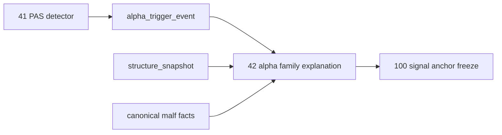

# 42-alpha-family-role-and-malf-alignment 结论
更新时间 `2026-04-13`
状态 `已完成`

## 结论

- 接受：`alpha family ledger` 已从最小 `family_code` 账本升级为正式家族解释层。
- 接受：`alpha_family_event.payload_json` 已冻结 `family_role / malf_alignment / malf_phase_bucket / family_bias` 等正式解释键。
- 接受：`family_runner` 已严格绑定官方输入：
  - `alpha_trigger_event`
  - `alpha_trigger_candidate`
  - `structure_snapshot`
  - `malf_state_snapshot`

## 收口范围

1. `alpha-family-v2` 已成为当前 family payload 正式合同版本
2. `family_event_nk` 已对齐 `source_trigger_event_nk + family_contract_version`
3. 五触发已具备默认角色判定与 canonical malf 协同解释
4. `source_context_fingerprint + source_context_snapshot` 已形成 rematerialize 审计依据
5. `41` 的 PAS detector 输出已验证可直接进入新的 family ledger

## 未在本卡内处理的事项

1. `alpha_formal_signal_event` 仍未物理升级消费 family 正式解释键
   - 这是 `100+` 的 signal anchor / trade 合同卡范围

2. compat-only 的 `malf_context_4 / lifecycle_rank_*`
   - 本卡未物理移除，只裁决其不再作为 family 正式真值来源

3. 全仓历史治理长度债务
   - `check_development_governance.py` 仍被既有 data 文件长度盘点阻断
   - 本卡未新增相关债务

## 下一步

- `42` 已完成 alpha family role 与 canonical malf 协同语义收口。
- 当前待施工卡切回 `100-trade-signal-anchor-contract-freeze-card-20260411.md`。

