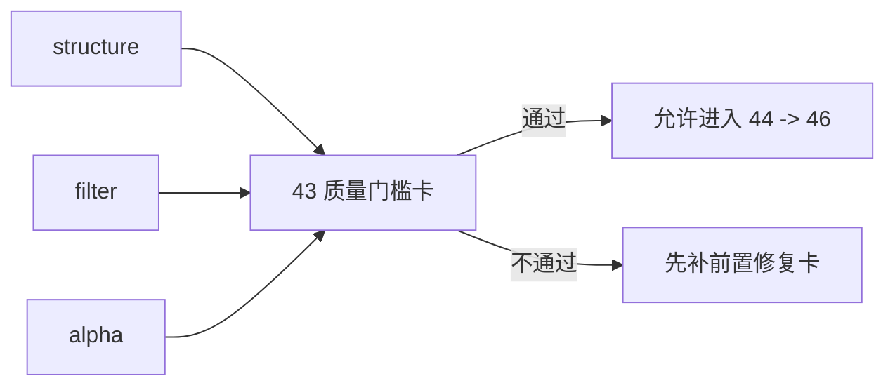

# structure/filter/alpha 达到 data-grade 质量门槛后再进入 position

卡片编号：`43`
日期：`2026-04-13`
状态：`草稿`

## 需求

- 问题：
  当前 `structure / filter / alpha` 虽已完成 canonical rebind 与 `35` 的 queue/checkpoint 对齐，但整体质量仍未达到 `data -> malf` 的事实标准。如果现在直接进入 `position`，后续执行侧缺陷将无法区分到底来自上游 canonical downstream，还是来自 `position / trade / system` 自身。
- 目标结果：
  新增一张正式质量门槛卡，明确裁决 `structure / filter / alpha` 是否已经达到进入 `position` 的 data-grade 质量要求；通过后只允许继续 `44 -> 46` 与后续 `47 -> 55`，`100 -> 105` 仍冻结到 `55`。
- 为什么现在做：
  `42` 已完成 alpha family 与 canonical malf 协同收口，但在真正进入 `position` 之前，必须先把上游 canonical downstream 的质量门槛写死，并驱动 `44 -> 46` 的硬化链；否则 `47-55` 乃至后续 `100-105` 的问题都会被污染成“上下游一起不稳”。

## 设计输入

- 设计文档：
  - `docs/01-design/modules/system/12-structure-filter-alpha-data-grade-quality-gate-before-position-charter-20260413.md`
- 规格文档：
  - `docs/02-spec/modules/system/12-structure-filter-alpha-data-grade-quality-gate-before-position-spec-20260413.md`
  - `docs/01-design/03-historical-ledger-shared-contract-charter-20260409.md`
  - `docs/03-execution/35-downstream-data-grade-checkpoint-alignment-after-malf-conclusion-20260412.md`
  - `docs/03-execution/42-alpha-family-role-and-malf-alignment-conclusion-20260413.md`

## 任务分解

1. 盘点 `structure / filter / alpha` 当前相对 `data -> malf` 的真实质量缺口，逐项映射到六条历史账本约束。
2. 冻结进入 `position` 前必须满足的 data-grade 质量门槛，并明确哪些缺口会阻断 `44 -> 55` 以及最终 `55` 之后的 `100-105`。
3. 更新系统路线图、执行索引与当前施工位，把 `43` 正式插入 `42` 与 `100` 之间。

## 实现边界

- 范围内：
  - `docs/01-design/modules/system/12-*`
  - `docs/02-spec/modules/system/12-*`
  - `docs/03-execution/43-*`
  - 执行索引与系统路线图的同步刷新
- 范围外：
  - `position` 业务实现
  - `trade exit / pnl / progression`
  - live runtime / orchestration 代码

## 历史账本约束

- 实体锚点：
  `structure / filter / alpha` 的检查以 `asset_type + code + timeframe='D'` 为上游主语义锚点；`alpha` 事件层再叠加 `trigger / family / formal signal` 业务键。
- 业务自然键：
  检查 `snapshot_date or bar_dt + contract version + source_fingerprint` 是否已成为正式自然键的一部分；`run_id` 不得替代业务主键。
- 批量建仓：
  显式 bounded bootstrap 仍保留，但只作为首次建仓与补跑接口；本卡将核查其是否已从“默认运行口径”降级为“bootstrap / 补跑接口”。
- 增量更新：
  检查 `structure / filter / alpha` 是否已按 canonical upstream `checkpoint + dirty/work queue` 驱动，而不是依赖全窗口重跑。
- 断点续跑：
  检查 `work_queue + checkpoint + replay/resume + rematerialize` 是否已在正式账本上成立，并可解释中断后恢复边界。
- 审计账本：
  审计必须落在 `*_run / *_checkpoint / *_work_queue / event or snapshot` 及 `43` 的 evidence / record / conclusion，不允许只靠聊天裁决。

## 收口标准

1. `structure / filter / alpha` 的质量门槛清单写清
2. 当前路线图与执行索引完成切换
3. evidence / record / conclusion 写完
4. 正式裁决“是否允许继续进入 `44 -> 46`”，并声明 `100-105` 仍冻结到 `55`

## 卡片结构图

