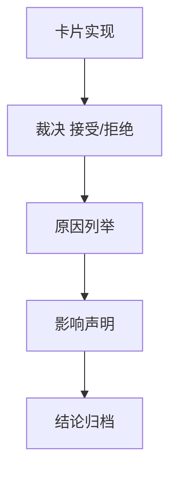

# structure/filter/alpha 达到 data-grade 质量门槛后再进入 position 结论

结论编号：`43`
日期：`2026-04-13`
状态：`草稿`

## 裁决

- 接受：
  `structure / filter / alpha` 已达到进入 `position` 的 data-grade 质量门槛，可恢复 `100`
- 拒绝：
  当前不得进入 `position`；必须先补前置修复卡

## 原因

- 原因 1
  对照 `data -> malf` 的事实标准，检查官方 ledger、自然键、checkpoint、dirty/work queue、replay/resume 与真实 smoke 是否已经形成闭环
- 原因 2
  明确当前 `100` 是否已经拥有稳定上游，避免执行侧恢复阶段混入上游质量噪音

## 影响

- 影响 1
  若接受，当前待施工卡切回 `100`
- 影响 2
  若拒绝，必须新增或切换到前置修复卡，继续提升 `structure / filter / alpha` 质量

## 结论结构图

