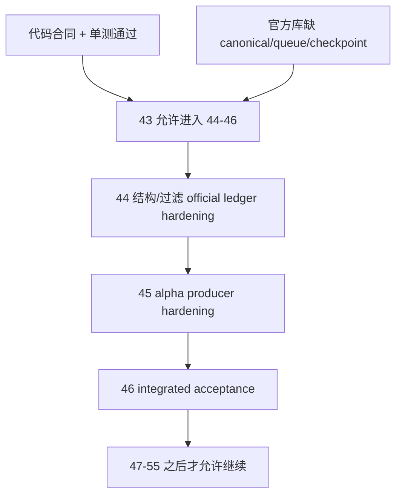

# structure/filter/alpha 达到 data-grade 质量门槛后再进入 position 结论

结论编号：`43`
日期：`2026-04-13`
状态：`已完成`

## 裁决

- 接受：
  `structure / filter / alpha` 的代码合同与测试覆盖已经足以进入 `44 -> 46` 的 pre-position 硬化链。
- 拒绝：
  当前不允许直接进入 `47 -> 55`，也不允许恢复 `100 -> 105`；必须先完成 `44 -> 46` 的官方账本硬化与 integrated acceptance。

## 原因

1. `structure / filter / alpha` 的主线代码已经符合进入下一阶段的最小 data-grade 合同：
   - `structure` 只接受 canonical `malf_state_snapshot(timeframe='D')`
   - `filter` 只接受官方 `structure_snapshot + canonical malf`
   - `alpha trigger / formal signal` 默认无窗口运行已切到 `queue + checkpoint + rematerialize`
   - 串行 `pytest` 已验证上游指纹变化触发 replay，以及 `alpha formal signal -> position` 的最小消费路径
2. 但 `H:\Lifespan-data` 的官方本地账本仍明显低于 `data -> malf` 的物理质量标准：
   - `malf` 官方库缺 canonical `state/checkpoint/stats/break` 表族
   - `structure / filter / alpha` 官方库仍未落地 `work_queue / checkpoint`
   - 因而官方 replay/resume/smoke 证据尚未成立，不能把当前状态判定为“已经可以进入 `position`”
3. `alpha formal signal` 的稳定 producer 合同仍未收口：
   - 官方表结构仍保留 `malf_context_4 / lifecycle_rank_*` compat-only 字段
   - `42` 冻结的 family 正式解释层还没有物理升级为 formal signal 的稳定输入合同
   - 因而 `45` 仍是进入 `46` 前的必要硬化卡

## 影响

1. 当前最新生效结论锚点推进到 `43-structure-filter-alpha-data-grade-quality-gate-before-position-conclusion-20260413.md`。
2. 当前待施工卡切换到 `44-structure-filter-official-ledger-replay-smoke-hardening-card-20260413.md`。
3. `44` 必须补齐 `structure / filter` 官方 ledger 的 replay/smoke 证据；`45` 必须补齐 `alpha formal signal` 的稳定 producer 合同；`46` 负责做 integrated acceptance。
4. 在 `46` 接受前，`47 -> 55` 不得恢复；在 `55` 接受前，`100 -> 105` 继续冻结。

## 六条历史账本约束检查

| 模块 | 实体锚点 | 业务自然键 | 批量建仓 | 增量更新 | 断点续跑 | 审计账本 |
| --- | --- | --- | --- | --- | --- | --- |
| `structure` | 已满足 | 部分满足 | 已满足 | 部分满足 | 部分满足 | 部分满足 |
| `filter` | 已满足 | 部分满足 | 已满足 | 部分满足 | 部分满足 | 部分满足 |
| `alpha` | 已满足 | 部分满足 | 已满足 | 部分满足 | 部分满足 | 部分满足 |

补充说明：

- `已满足` 指代码合同、脚本入口与单测覆盖已经成立。
- `部分满足` 指代码已支持，但 `H:\Lifespan-data` 官方库尚未完成同级物理硬化，或正式 producer 合同仍有 compat-only 过渡项未收口。

## 模块级结论

1. `structure`
   - 已完成 canonical 输入绑定与默认 queue/checkpoint 代码路径。
   - 但官方 `structure.duckdb` 仍只有 `run / snapshot / run_snapshot`，缺 `structure_work_queue / structure_checkpoint`；`44` 必须把它补齐并留下真实 replay/smoke 证据。
2. `filter`
   - 已完成只读消费 `structure_snapshot + canonical malf` 的正式合同，并具备默认 queue/checkpoint 路径。
   - 但官方 `filter.duckdb` 仍缺 `filter_work_queue / filter_checkpoint`；`44` 必须把它补齐并验证与 `structure checkpoint` 的对齐。
3. `alpha`
   - `trigger / family / formal signal` 的代码链路已经闭合，且最小 `position` 消费测试通过。
   - 但官方 `alpha.duckdb` 仍缺 `trigger/formal_signal` 的 `work_queue / checkpoint`，`alpha_formal_signal_event` 也仍保留 compat-only 列；`45` 必须把正式 producer 合同收口。

## 结论结构图

