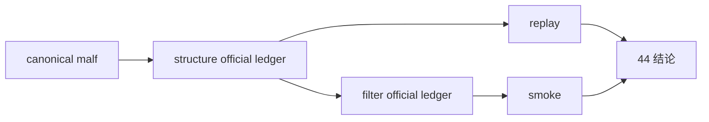

# structure/filter 官方 ledger replay 与 smoke 硬化

卡片编号：`44`
日期：`2026-04-13`
状态：`已完成`

## 需求

- 问题：
  `structure / filter` 虽已在 `35` 完成 queue/checkpoint 对齐，但这仍主要是 canonical downstream 级别的逻辑对齐，还没有像 `data / malf` 一样在官方本地 ledger 上证明 replay / smoke / audit 的运行质量。
- 目标结果：
  把 `structure / filter` 的官方本地 ledger 路径、默认 queue 运行口径、replay/resume 与真实 smoke 证据硬化到可作为 `position` 稳定上游的程度。
- 为什么现在做：
  `43` 已正式裁决：当前可以继续进入 `44 -> 46`，但不能直接进入 `47 -> 55`。`44` 负责先补齐 `structure / filter` 在 `H:\Lifespan-data` 官方库上的物理 ledger、replay/resume 与 smoke 证据，避免后续把 `position` 问题与上游账本问题混在一起。

## 设计输入

- 设计文档：
  - `docs/01-design/modules/system/13-structure-filter-official-ledger-replay-smoke-hardening-charter-20260413.md`
- 规格文档：
  - `docs/02-spec/modules/system/13-structure-filter-official-ledger-replay-smoke-hardening-spec-20260413.md`
  - `docs/03-execution/35-downstream-data-grade-checkpoint-alignment-after-malf-conclusion-20260412.md`
  - `docs/03-execution/43-structure-filter-alpha-data-grade-quality-gate-before-position-conclusion-20260413.md`
  - `docs/03-execution/38-structure-filter-mainline-legacy-malf-semantic-purge-conclusion-20260413.md`

## 任务分解

1. 盘点 `structure / filter` 当前官方本地 ledger 路径与默认运行口径。
2. 建立或验证 replay / resume / smoke 的真实官方库证据。
3. 裁决 `structure / filter` 是否已达到进入 `45` 的稳定上游标准。

## 实现边界

- 范围内：
  - `structure / filter` 官方 ledger 路径与 replay/smoke 证据
  - `docs/03-execution/44-*`
- 范围外：
  - `alpha formal signal producer`
  - `position`
  - `100-105`

## 历史账本约束

- 实体锚点：
  `asset_type + code + timeframe='D'`
- 业务自然键：
  `snapshot_date or bar_dt + contract version + source_fingerprint`
- 批量建仓：
  显式 `signal_start_date / signal_end_date / instruments` 的 bounded bootstrap 继续保留；同时必须为 `H:\Lifespan-data` 上的 `structure / filter` 官方库补齐一次正式 bootstrap 与 replay 起点。
- 增量更新：
  `structure` 必须由 canonical `malf checkpoint` 驱动 queue，`filter` 必须由 `structure checkpoint` 驱动 queue，不允许回退到默认全窗口重跑。
- 断点续跑：
  `work_queue + checkpoint + replay/resume` 必须在官方库上可复现，并能解释中断后如何接续到最后一个 `tail` 边界。
- 审计账本：
  `structure_run / structure_snapshot / structure_run_snapshot / structure_work_queue / structure_checkpoint` 与 `filter_run / filter_snapshot / filter_run_snapshot / filter_work_queue / filter_checkpoint`

## 收口标准

1. `structure / filter` 官方 ledger 路径与运行口径写清
2. replay / smoke 证据写完
3. 记录与结论写完
4. 明确是否允许进入 `45`

## 卡片结构图

