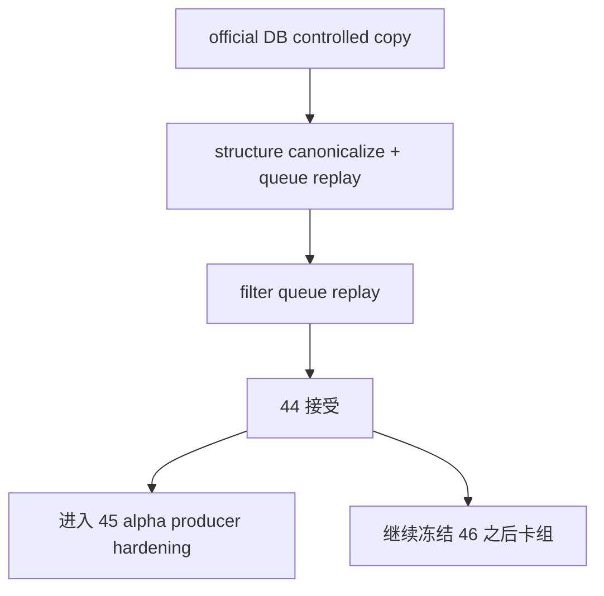

# structure/filter 官方 ledger replay 与 smoke 硬化结论

结论编号：`44`
日期：`2026-04-13`
状态：`已完成`

## 裁决

- 接受：
  `structure / filter` 已完成进入 `45` 所需的 official-ledger replay / smoke 硬化。
- 拒绝：
  当前仍不允许跳过 `45` 直接进入 `46`，更不允许恢复 `47 -> 55 / 100 -> 105`。

## 原因

1. `structure` 的 legacy official schema 阻断已被正式收口：
   - 受控复制自 `H:\Lifespan-data\structure\structure.duckdb` 的旧库在首轮 smoke 中暴露出 `malf_context_4 / lifecycle_rank_*` compat-only `NOT NULL` 列阻断。
   - `structure bootstrap` 现已支持在遇到 legacy official `structure_snapshot` 时重建 canonical schema，并同步清理失配的 `structure_run_snapshot`。
   - 回归测试已把这条迁移路径写死，避免再次只在“新库”上通过。
2. `structure` 的 replay/resume 已在 official copy 上形成物理证据：
   - 首轮默认 queue 运行补齐 `structure_work_queue / structure_checkpoint`
   - 月级 `malf` 指纹推进后，第二轮默认 queue 触发 `source_fingerprint_changed`
   - `structure-run-2` 已留下 `rematerialized_count=1`、`checkpoint_upserted_count=1` 与尾部边界 `2026-03-31 -> 2026-04-08`
3. `filter` 的 replay/resume 已在 official copy 上跟随 `structure checkpoint` 对齐：
   - 首轮默认 queue 运行补齐 `filter_work_queue / filter_checkpoint`
   - `structure checkpoint` 指纹推进后，第二轮默认 queue 同样触发 `source_fingerprint_changed`
   - `filter-run-2` 已留下 `rematerialized_count=1`、`checkpoint_upserted_count=1` 与相同尾部边界
4. 本卡的 smoke 证据满足 `44` 设计允许的“官方路径或受控复制”边界：
   - 当前 `H:\Lifespan-data\malf\malf.duckdb` 仍是 bridge-era 表族，因此本卡没有直接改写正式 `malf` 真值库
   - 但 `H:\Lifespan-temp\card44\controlled-data` 已证明复制自 official DuckDB 的 `structure / filter` 可以在 canonical upstream 下完成 queue/replay/smoke

## 影响

1. 当前最新生效结论锚点推进到 `44-structure-filter-official-ledger-replay-smoke-hardening-conclusion-20260413.md`。
2. 当前待施工卡切换到 `45-alpha-formal-signal-producer-hardening-before-position-card-20260413.md`。
3. `structure / filter` 已从“canonical downstream 对齐”推进到“official ledger replay/smoke 已硬化”的阶段；`45` 现在只剩 `alpha formal signal` producer 稳定性需要收口。
4. `46` 之前仍不得进入 `position`；`55` 之前仍不得恢复 `100 -> 105`。

## 六条历史账本约束检查

| 模块 | 实体锚点 | 业务自然键 | 批量建仓 | 增量更新 | 断点续跑 | 审计账本 |
| --- | --- | --- | --- | --- | --- | --- |
| `structure` | 已满足 | 已满足 | 已满足 | 已满足 | 已满足 | 已满足 |
| `filter` | 已满足 | 已满足 | 已满足 | 已满足 | 已满足 | 已满足 |

补充说明：

- 本表的“已满足”指 `official copy` 上的 DuckDB 实体链路、默认 queue/replay 运行口径、测试和证据已经同时成立。
- 当前未在本卡中处理的 official `malf` 真值库升级，不影响 `44` 对 `structure / filter` ledger hardening 的接受裁决。

## 模块级结论

1. `structure`
   - 已具备在 legacy official DB 副本上自动 canonical 化 `structure_snapshot` 的能力。
   - 默认 queue 模式已在复制自 official 的 DuckDB 上验证 `inserted -> rematerialized` 与 `checkpoint tail replay`。
2. `filter`
   - 已具备在 legacy official DB 副本上自动补齐 `filter_work_queue / filter_checkpoint` 的能力。
   - 默认 queue 模式已验证跟随 `structure checkpoint` 做 replay/rematerialize，不回退到 bounded 全窗口重跑。

## 结论结构图

