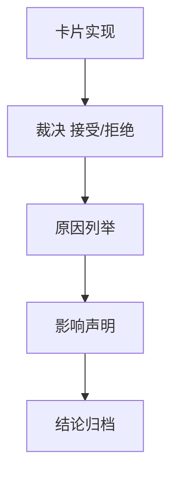

# structure/filter 官方 ledger replay 与 smoke 硬化 结论

结论编号：`44`
日期：`2026-04-13`
状态：`草稿`

## 裁决

- 接受：
  `structure / filter` 已达到官方 ledger replay / smoke 硬化标准，可进入 `45`
- 拒绝：
  `structure / filter` 尚未达到进入 `45` 的稳定上游标准，必须先补修复卡

## 原因

- 原因 1
  当前要验证的不只是 queue/checkpoint 存在，而是官方本地 ledger 上的 replay / smoke / audit 是否成立
- 原因 2
  若 `structure / filter` 还不稳定，`alpha formal signal` 的 producer 硬化会建立在不可靠上游上

## 影响

- 影响 1
  若接受，允许进入 `45`
- 影响 2
  若拒绝，`43` 的质量闸门结论不能通过

## 结论结构图

