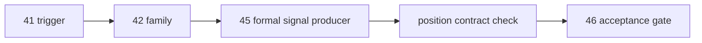

# alpha formal signal producer 在进入 position 前硬化

卡片编号：`45`
日期：`2026-04-13`
状态：`已完成`

## 需求
- 问题：
  `41/42/44` 已冻结 detector、family 与 structure/filter official ledger，但 `alpha formal signal` 仍需证明自己已经成为可被 `position` 正式消费的稳定 producer。
- 目标结果：
  把 `alpha_family_event` 的正式解释键物理接入 `alpha_formal_signal_event / alpha_formal_signal_run_event`，补齐 family-aware queue/checkpoint/rematerialize 证据，并同步确认 `position` 消费合同兼容升级。
- 为什么现在做：
  `45` 是 `46` integrated acceptance 之前最后一个必须单独收口的 alpha producer 硬化卡。

## 设计输入
- 设计文档：
  - `docs/01-design/modules/alpha/06-alpha-formal-signal-producer-hardening-before-position-charter-20260413.md`
- 规格文档：
  - `docs/02-spec/modules/alpha/06-alpha-formal-signal-producer-hardening-before-position-spec-20260413.md`
- 上游结论：
  - `docs/03-execution/41-alpha-pas-five-trigger-canonical-detector-conclusion-20260413.md`
  - `docs/03-execution/42-alpha-family-role-and-malf-alignment-conclusion-20260413.md`
  - `docs/03-execution/44-structure-filter-official-ledger-replay-smoke-hardening-conclusion-20260413.md`

## 任务分解
1. 为 `alpha formal signal` 引入 `alpha_family_event` 正式解释键的物理接入与 run 审计落点。
2. 让 queue/checkpoint 的 source fingerprint 显式覆盖 family scope 变化，确保 family-only 变化也会触发 rematerialize。
3. 升级 `position` 对 `alpha formal signal` 的消费合同，保证新列可读且旧列缺失时仍兼容。
4. 回填 `45` 的 card / evidence / record / conclusion / execution indexes。

## 实现边界
- 范围内：
  - `src/mlq/alpha` formal signal producer
  - `scripts/alpha/run_alpha_formal_signal_build.py`
  - `src/mlq/position` formal signal 消费合同
  - `tests/unit/alpha/test_runner.py`
  - `tests/unit/position/test_position_runner.py`
  - `docs/03-execution/45-*`
- 范围外：
  - `46` integrated acceptance 实施
  - `47 -> 55` position / portfolio_plan 前置卡组
  - `100 -> 105` trade / system 卡组解冻

## 历史账本约束
- 实体锚点：
  `asset_type + code + timeframe='D'`
- 业务自然键：
  `signal_nk + signal_contract_version + source_trigger_event_nk + source_family_event_nk`
- 批量建仓：
  bounded build 从官方 `alpha_trigger_event + alpha_family_event + filter_snapshot + structure_snapshot` 回填正式 signal ledger
- 增量更新：
  checkpoint queue 按 `instrument + timeframe + source_fingerprint` 维护 dirty scope
- 断点续跑：
  `alpha_formal_signal_work_queue + alpha_formal_signal_checkpoint + rematerialize`
- 审计账本：
  `alpha_formal_signal_run / alpha_formal_signal_event / alpha_formal_signal_run_event`

## 收口标准
1. `alpha formal signal` 物理落表包含 `alpha_family_event` 正式解释键。
2. family-only 变化能够触发 queue replay / rematerialize。
3. `position` 可以读取新列且保持旧表兼容。
4. 单测、proof JSON、evidence、record、conclusion、execution indexes 全部回填完成。
5. 明确允许进入 `46`，但不允许跳过 `46` 直接解冻 `47 -> 55 / 100 -> 105`。

## 卡片结构图

