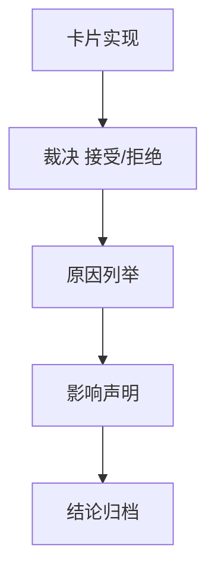

# alpha formal signal producer 在进入 position 前硬化 结论

结论编号：`45`
日期：`2026-04-13`
状态：`草稿`

## 裁决

- 接受：
  `alpha formal signal producer` 已达到进入 `46` 的稳定 producer 标准
- 拒绝：
  `alpha formal signal producer` 仍未达到进入 `46` 的稳定 producer 标准

## 原因

- 原因 1
  当前要裁决的是 `formal signal` 是否已经摆脱 family/compat-only 过渡语义的不确定性
- 原因 2
  `100` 只能冻结 trade signal anchor，不能替代 `45` 解决 producer 稳定性本身

## 影响

- 影响 1
  若接受，允许进入 `46`
- 影响 2
  若拒绝，`100` 继续保持冻结

## 结论结构图

