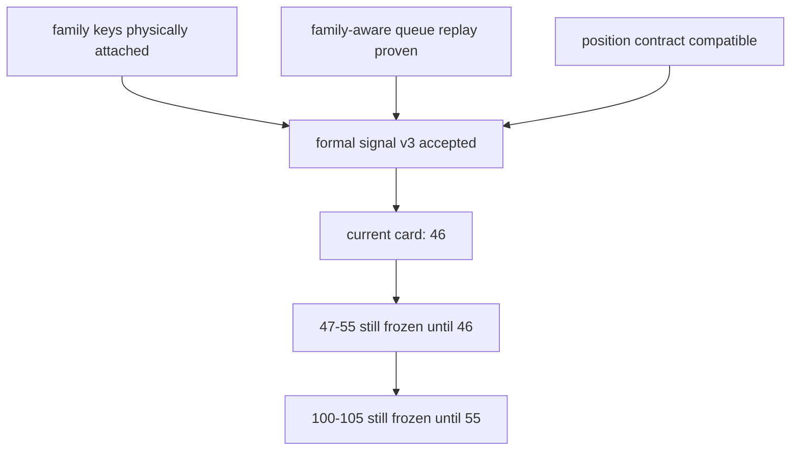

# alpha formal signal producer 在进入 position 前硬化结论

结论编号：`45`
日期：`2026-04-13`
状态：`已完成`

## 裁决
- 接受：
  `alpha formal signal producer` 已达到进入 `46` 的稳定 producer 标准。
- 拒绝：
  本结论不允许跳过 `46` 直接进入 `47 -> 55`，也不允许提前解冻 `100 -> 105`。

## 原因
- 原因 1
  `alpha_formal_signal_run / event / run_event` 已物理接入 `alpha_family_event` 正式解释键，`alpha formal signal` 不再停留在只消费 trigger 的旧 producer 口径。
- 原因 2
  queue/checkpoint 的 `source_fingerprint` 已纳入 family scope fingerprint，family-only 变化能够触发 `dirty_reason='source_fingerprint_changed'` 与正式 rematerialize。
- 原因 3
  `position` 的消费合同已完成 family-aware 兼容升级，新列可读、旧表缺列可降级，不再阻塞 `46` 对 upstream contract 的集成验收。

## 影响
- 影响 1
  当前最新生效结论锚点推进到 `45-alpha-formal-signal-producer-hardening-before-position-conclusion-20260413.md`。
- 影响 2
  当前待施工卡前移到 `46-pre-position-upstream-acceptance-gate-card-20260413.md`。
- 影响 3
  `47 -> 55` 仍冻结在 `46` 之后，必须等 `46` 接受后才能继续。
- 影响 4
  `100 -> 105` 仍冻结在 `55` 之后，必须等 `55` 接受后才能恢复。

## 结论结构图

