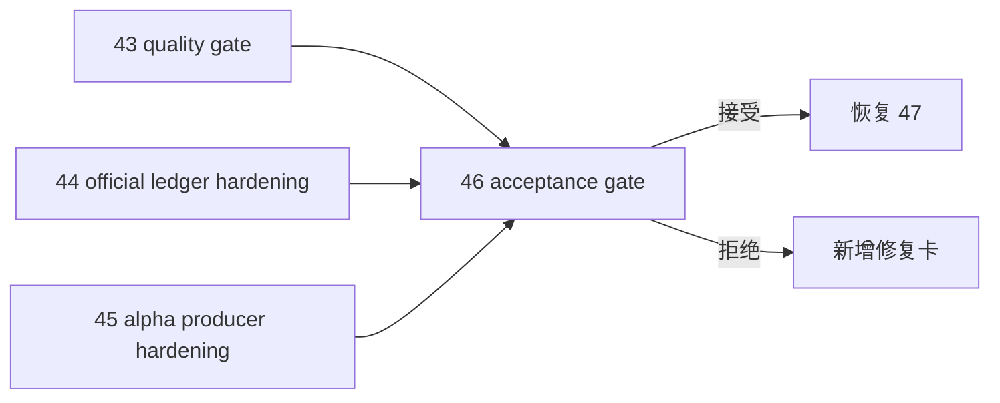

# 进入 position 前的 upstream acceptance gate

卡片编号：`46`
日期：`2026-04-13`
状态：`已开卡`

## 需求
- 问题：
  即使 `43 / 44 / 45` 已各自完成，也仍需要一张系统级 acceptance gate 卡，正式裁决当前 upstream 是否允许进入 `position` 卡组，并决定 `47` 能否恢复为当前待施工卡。
- 目标结果：
  形成进入 `position` 前的最终 upstream acceptance gate；只有 `46` 接受后，`47` 才恢复为当前待施工卡，而 `100-105` 仍冻结到 `55`。
- 为什么现在做：
  `46` 负责把“质量门、official ledger hardening、alpha producer hardening 已分别完成”升级成“系统级允许进入下游”的唯一正式裁决。

## 设计输入
- 设计文档：
  - `docs/01-design/modules/system/14-pre-position-upstream-acceptance-gate-charter-20260413.md`
- 规格文档：
  - `docs/02-spec/modules/system/14-pre-position-upstream-acceptance-gate-spec-20260413.md`
  - `docs/03-execution/43-structure-filter-alpha-data-grade-quality-gate-before-position-conclusion-20260413.md`
  - `docs/03-execution/44-structure-filter-official-ledger-replay-smoke-hardening-conclusion-20260413.md`
  - `docs/03-execution/45-alpha-formal-signal-producer-hardening-before-position-conclusion-20260413.md`

## 任务分解
1. 汇总 `43 / 44 / 45` 的正式结论、测试证据与 proof 产物。
2. 裁决当前 upstream 是否满足进入 `position` 卡组的正式准入条件。
3. 若接受，则把当前待施工卡恢复到 `47`；若拒绝，则明确新增阻断点与修复入口。
4. 回填 `46` 的 evidence / record / conclusion 与 execution indexes。

## 实现边界
- 范围内：
  - upstream acceptance 裁决
  - execution 索引切换
  - `docs/03-execution/46-*`
- 范围外：
  - `position` 实现
  - `100` trade signal anchor freeze
  - `trade / system` 业务修复

## 历史账本约束
- 实体锚点：
  以 `structure / filter / alpha` 上游正式结论集合与当前 gate 场景作为 acceptance 输入锚点
- 业务自然键：
  `pre-position-upstream-acceptance scene + 43/44/45 conclusion set`
- 批量建仓：
  不适用业务建仓；首次形成 `43 / 44 / 45` 汇总 acceptance 裁决即视为本卡首轮建仓
- 增量更新：
  每当 `43 / 44 / 45` 任一正式结论或关键证据更新时，重新执行一次 gate 裁决
- 断点续跑：
  以 `46` 的 card / evidence / record / conclusion 与 execution index 切换作为 gate 的恢复点
- 审计账本：
  `46` 的 evidence / record / conclusion 与 execution index 变更记录

## 收口标准
1. `43 / 44 / 45` 的汇总判断写清。
2. `46` 的 evidence / record / conclusion 回填完成。
3. 明确是否恢复 `47` 为当前待施工卡。
4. execution 索引、completion ledger 与路线图同步切换。

## 卡片结构图

