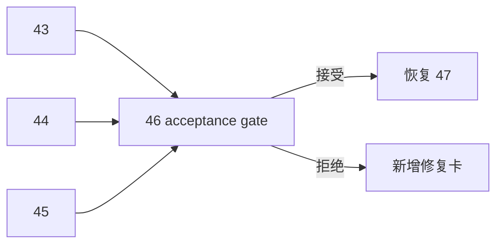

# 进入 position 前的 upstream acceptance gate

卡片编号：`46`
日期：`2026-04-13`
状态：`草稿`

## 需求

- 问题：
  即使 `43/44/45` 各自完成，也仍需要一张系统级 acceptance 卡来正式裁决：当前是否允许进入 `position` 卡组，以及 `47` 是否可以恢复为下一卡。
- 目标结果：
  形成进入 `position` 前的最终 upstream acceptance gate；只有 `46` 接受后，`47` 才恢复为当前待施工卡，而 `100-105` 仍冻结到 `55`。
- 为什么现在做：
  `46` 是把“前面几张卡做完了”升级成“系统级允许进入下游”的唯一正式裁决点。

## 设计输入

- 设计文档：
- 设计文档：
  - `docs/01-design/modules/system/14-pre-position-upstream-acceptance-gate-charter-20260413.md`
- 规格文档：
- 规格文档：
  - `docs/02-spec/modules/system/14-pre-position-upstream-acceptance-gate-spec-20260413.md`
  - `docs/03-execution/43-structure-filter-alpha-data-grade-quality-gate-before-position-conclusion-20260413.md`
  - `docs/03-execution/44-structure-filter-official-ledger-replay-smoke-hardening-conclusion-20260413.md`
  - `docs/03-execution/45-alpha-formal-signal-producer-hardening-before-position-conclusion-20260413.md`

## 任务分解

1. 汇总 `43 / 44 / 45` 的正式裁决与证据。
2. 判断当前是否允许进入 `position` 卡组。
3. 若允许，恢复 `47`；若不允许，明确新的前置修复卡。

## 实现边界

- 范围内：
- 范围内：
  - upstream acceptance 裁决
  - 执行索引切换
  - `docs/03-execution/46-*`
- 范围外：
- 范围外：
  - `position` 实现
  - `100` 实现
  - `trade / system` 业务修复

## 历史账本约束

- 实体锚点：
- 实体锚点：
  以 `structure / filter / alpha` 上游稳定主语义与其结论编号为 acceptance 输入锚点
- 业务自然键：
- 业务自然键：
  以 `current upstream gate scene + conclusion set` 作为 acceptance 自然键
- 批量建仓：
- 批量建仓：
  不适用业务建仓；等价为首次形成上游综合 acceptance 裁决
- 增量更新：
- 增量更新：
  每当 `43 / 44 / 45` 任何一张裁决更新时，重新裁决一次
- 断点续跑：
- 断点续跑：
  以 execution 文档与索引切换作为 gate 恢复点
- 审计账本：
- 审计账本：
  `46` 的 evidence / record / conclusion 与执行索引变更记录

## 收口标准

1. `43 / 44 / 45` 的汇总判断写清
2. evidence / record / conclusion 写完
3. 明确是否恢复 `47`
4. 索引与路线图同步切换

## 卡片结构图

