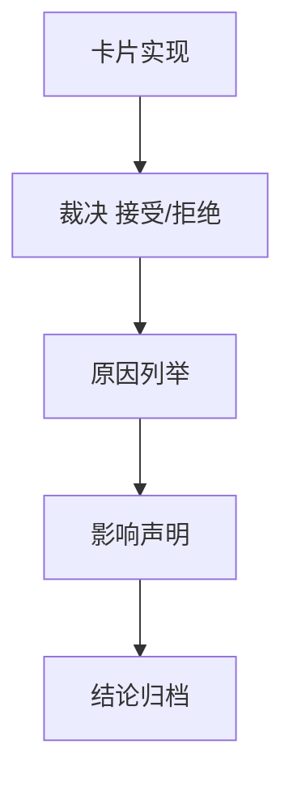

# 进入 position 前的 upstream acceptance gate 结论

结论编号：`46`
日期：`2026-04-13`
状态：`草稿`

## 裁决

- 接受：
  当前允许进入 `position` 卡组，`47` 恢复为当前待施工卡
- 拒绝：
  当前不允许进入 `position`，必须新增前置修复卡

## 原因

- 原因 1
  `46` 必须汇总 `43 / 44 / 45` 的正式裁决，而不是凭单张卡的局部通过就直接启动 `47`
- 原因 2
  只有 upstream acceptance 成立后，`47 -> 55` 才有资格继续推进；`100-105` 仍需等 `55`

## 影响

- 影响 1
  若接受，执行索引与路线图切回 `47`
- 影响 2
  若拒绝，执行索引与路线图继续停留在 upstream 修复阶段，且 `100-105` 保持冻结

## 结论结构图

