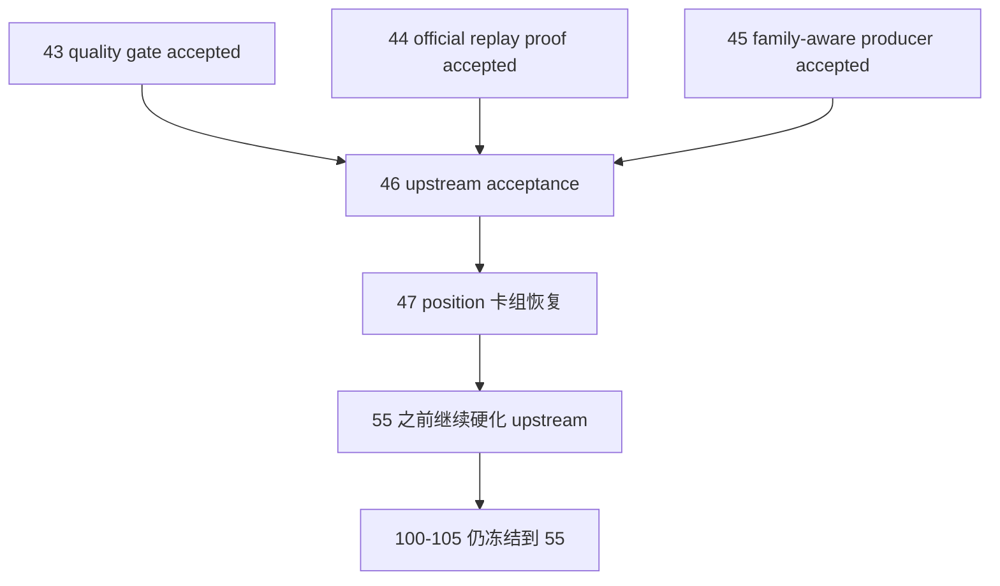

# 进入 position 前的 upstream acceptance gate 结论

结论编号：`46`
日期：`2026-04-13`
状态：`已完成`

## 裁决

- 接受：
  当前允许进入 `position` 卡组，`47` 恢复为当前待施工卡。
- 拒绝：
  当前不允许提前恢复 `100 -> 105`，也不允许把 `46` 误读为 `position` 已经完成 data-grade 硬化。

## 原因

1. `43` 已经完成系统级质量门槛定义，并明确剩余阻断只位于 `44 / 45 / 46`：
   - `structure / filter / alpha` 代码合同已经具备进入 pre-position 硬化链的条件
   - 当时不能进入 `47` 的原因，是 official ledger replay/smoke 与 formal signal producer 合同尚未收口
2. `44` 已把 `structure / filter` 的 official-copy replay/resume 证据落成物理事实：
   - `H:\Lifespan-temp\card44\summary\structure-run-2.json`
   - `H:\Lifespan-temp\card44\summary\filter-run-2.json`
   - 两份 summary 都已经留下 `rematerialized_count=1` 与 `checkpoint_upserted_count=1`
3. `45` 已把 `alpha formal signal` 升级为 family-aware 正式 producer，并证明 queue replay 不再遗漏 family-only 变化：
   - bounded proof 已写实 `signal_contract_version='alpha-formal-signal-v3'`
   - 正式输入已物理接入 `source_family_table='alpha_family_event'`
   - queue replay proof 已留下 `dirty_reason='source_fingerprint_changed'` 与 `last_run_id='card45-proof-formal-queue-b'`
4. 因此，`structure -> filter -> alpha` 作为进入 `position` 前的 upstream 已形成统一稳定准入合同：
   - `structure / filter` 不再停留在“只有代码路径、没有 official replay 证据”
   - `alpha formal signal` 不再停留在“只有 trigger 输入、没有 family-aware 稳定 producer”
   - 当前剩余工作已经前移到 `47 -> 55` 的 `position / portfolio_plan` 卡组，而不是继续滞留在 upstream

## 影响

1. 当前最新生效结论锚点推进到 `46-pre-position-upstream-acceptance-gate-conclusion-20260413.md`。
2. 当前待施工卡恢复到 `47-position-malf-context-driven-sizing-and-batch-contract-card-20260413.md`。
3. `47 -> 55` 现在可以按既定顺序继续推进：
   - `47-51` 负责把 `position` 抬到 A-grade
   - `52-55` 负责把 `portfolio_plan` 抬到 A-grade，并完成 pre-trade upstream baseline gate
4. `100 -> 105` 继续冻结在 `55` 之后；`46` 的接受不改变该边界。

## 六条历史账本约束检查

| 模块 | 实体锚点 | 业务自然键 | 批量建仓 | 增量更新 | 断点续跑 | 审计账本 |
| --- | --- | --- | --- | --- | --- | --- |
| `structure` | 已满足 | 已满足 | 已满足 | 已满足 | 已满足 | 已满足 |
| `filter` | 已满足 | 已满足 | 已满足 | 已满足 | 已满足 | 已满足 |
| `alpha` | 已满足 | 已满足 | 已满足 | 已满足 | 已满足 | 已满足 |

补充说明：

- 本表表示“进入 `position` 前的 upstream 准入责任”已经完成，而不是 `position / portfolio_plan / trade / system` 已经对齐。
- `alpha` 的最终执行侧 anchor 仍要等 `100` 冻结，但这不再构成进入 `47` 的阻断项。

## 模块级结论

1. `structure`
   - 已具备 canonical 输入、official-copy replay/resume 与默认 queue 路径的统一证据链。
2. `filter`
   - 已证明能够跟随 `structure checkpoint` 做真实 replay/rematerialize，而不是回退到 bounded 全窗口重跑。
3. `alpha`
   - 已具备 family-aware formal signal producer、family scope fingerprint replay，以及 `position` 消费兼容合同。

## 结论结构图

