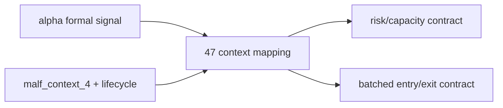

# position MALF 驱动仓位与分批合同冻结

`卡号`：`47`
`日期`：`2026-04-13`
`状态`：`待施工`

## 问题

- `position` 目前仍是最小 bounded materialization，`_context_max_position_weight` 只是简化硬编码，尚未升级为 MALF 驱动的正式仓位合同。
- 旧系统里 `FIXED_NOTIONAL_CONTROL / SINGLE_LOT_CONTROL / partial-exit` 的实验结论可以提供原则，但不能直接搬进主线。
- 用户已明确：不得随意改写现有 `t+0 / t+1 / t+2 ...` 语义，且主线最终要走向中线波段交易下的分批次进、分批次出。

## 设计依据

- [02-position-malf-context-driven-batched-management-charter-20260413.md](/H:/lifespan-0.01/docs/01-design/modules/position/02-position-malf-context-driven-batched-management-charter-20260413.md)
- [04-position-malf-context-driven-batched-management-spec-20260413.md](/H:/lifespan-0.01/docs/02-spec/modules/position/04-position-malf-context-driven-batched-management-spec-20260413.md)

## 任务

1. 冻结 `position` 的新正式职责：消费 `alpha formal signal`，落地“可以做多少、分几步做、何时减仓”的事实层。
2. 冻结 `malf_context_4 + lifecycle` 到 `context_behavior_profile + deployment_stage` 的正式映射。
3. 明确旧 positioning 结论中哪些可继承、哪些必须保留在研究层。
4. 明确 `t+0 / t+1 / t+2 ...` 在 `position` 内只能被参数化，不得被改写。

## 历史账本约束

1. `实体锚点`
   - `asset_type + code`，以及派生的 `candidate_nk / plan_leg_nk`。
2. `业务自然键`
   - `signal_nk + policy_id + reference_trade_date`。
3. `批量建仓`
   - 从正式 `alpha formal signal` 回灌全部 position 候选与计划。
4. `增量更新`
   - 对新增信号、context contract 变化、参考价变化做增量重算。
5. `断点续跑`
   - 本卡定义语义，不直接交付 runner，但必须为 `50` 留出 queue/checkpoint/replay 契约。
6. `审计账本`
   - `candidate / risk / capacity / sizing / entry / exit` 六层事实必须可追踪。

## A 级判定表

| 判定项 | A 级通过标准 | 不接受情形 | 交付物 |
| --- | --- | --- | --- |
| MALF 上下文映射冻结 | `malf_context_4 + lifecycle -> context_behavior_profile + deployment_stage` 形成版本化正式映射，并写入正式 position 账本字段 | 继续依赖硬编码 `_context_max_position_weight`、运行时临时 `if/else` 或研究层枚举直接驱动正式仓位 | 设计/规格裁决 + position 正式字段与映射表 |
| 仓位与分批主语义 | `position` 明确回答“能做多少、分几步做、何时减仓”，并以候选/计划腿事实层持久化，而不是只产出单个 `target_weight` | 仍只有单步 `target_weight / target_shares`，或把分批逻辑推迟到 `trade` 临时决定 | `candidate / sizing / entry_leg_plan / exit_plan` 正式合同 |
| 自然键与实体锚点 | `candidate_nk / plan_leg_nk` 绑定 `asset_type + code + signal_nk + policy_id + reference_trade_date`，`run_id` 不参与业务主键 | 以 `run_id`、name 或脚本窗口充当主语义 | 自然键定义、DDL 或字段契约 |
| 历史回灌与切片建仓 | 支持按历史 `alpha formal signal`、日期窗口、标的切片回灌全部候选与计划腿 | 只能全量重跑，或只能在内存里临时生成 DataFrame | bootstrap 入口与切片参数说明 |
| 增量挂脏边界 | 对新增/重物化 signal、上下文 contract 变化、参考价变化只重算脏候选与脏计划腿 | 任意变化都触发全窗口重算，或 dirty 单元无法解释 | dirty 触发清单与 rematerialize 规则 |
| 下游消费边界 | `portfolio_plan` 只读消费 `position` 正式账本，不回读 helper 或 `alpha` 私有过程；`position` 不写 `trade` 事实 | `portfolio_plan` 仍需读取内部 helper，或 `position` 越界落交易意图/成交事实 | 下游输入合同与边界声明 |

## 图示

