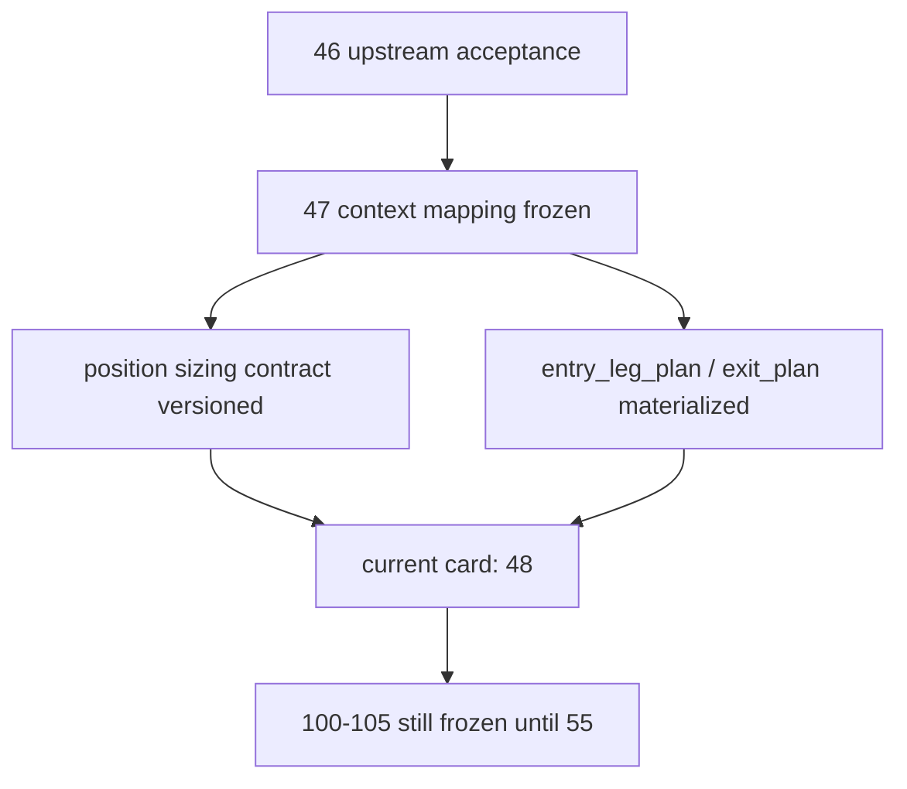

# position MALF 驱动仓位与分批合同冻结结论

结论编号：`47`
日期：`2026-04-14`
状态：`已完成`

## 裁决
- 接受：
  `position` 已完成 MALF context 驱动的 sizing / batch contract 冻结，当前待施工卡前移到 `48`。
- 拒绝：
  本结论不等于 `48-50` 的 risk/capacity/data-grade runner 已完成，也不允许提前恢复 `100 -> 105`。

## 原因
1. `malf_context_4 + lifecycle` 已被版本化冻结为 `context_behavior_profile + deployment_stage + context_weight_rule_code`。
   - `position_candidate_audit / position_capacity_snapshot / position_sizing_snapshot` 已正式落下这些字段。
   - `_context_max_position_weight` 不再是运行时硬编码公式，而是显式的 mapping contract。
2. `position_policy_registry` 已升级为带 `position_contract_version` 与 `entry/trim/exit schedule default` 的正式契约。
   - `t+0 / t+1 / t+2 ...` 不再隐含在代码分支里，而是作为参数化 schedule 字段进入账本。
3. `position_entry_leg_plan` 已正式落表，`position_exit_plan / position_exit_leg` 已升级到可表达 `trim / terminal_exit` 的最小合同。
   - `portfolio_plan` 仍只消费 `position_candidate_audit / position_capacity_snapshot / position_sizing_snapshot`，下游 bridge 保持兼容。

## 影响
1. 当前最新生效结论锚点推进到 `47-position-malf-context-driven-sizing-and-batch-contract-conclusion-20260414.md`。
2. 当前待施工卡前移到 `48-position-risk-budget-and-capacity-ledger-hardening-card-20260413.md`。
3. `48 -> 55` 继续作为进入 `trade` 前的前置卡组推进。
4. `100 -> 105` 仍冻结到 `55` 接受之后。

## 六条历史账本约束检查
| 项目 | 当前状态 | 说明 |
| --- | --- | --- |
| 实体锚点 | 已满足 | `asset_type + code` 已进入 `position_candidate_audit`，并持续绑定 `candidate_nk / entry_leg_nk / exit_plan_nk`。 |
| 业务自然键 | 已满足 | `candidate_nk / entry_leg_nk / exit_plan_nk / exit_leg_nk` 均可由业务字段稳定复算。 |
| 批量建仓 | 已满足 | `materialize_position_from_formal_signals` 支持从正式 `alpha formal signal` 回灌候选、sizing、entry 与 exit 事实。 |
| 增量更新 | 已声明 | dirty/replay 仍由 `50` 交付，但 `47` 已把 contract version、schedule 与 plan NK 冻结到表结构。 |
| 断点续跑 | 已声明 | `47` 保留 queue/checkpoint 入口约束，不在本卡越界实现。 |
| 审计账本 | 已满足 | `run / candidate / capacity / sizing / entry / exit` 六层事实已可追踪。 |

## 结论结构图

