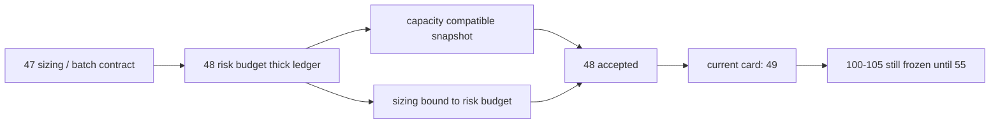

# position risk budget 与 capacity ledger 硬化结论
结论编号：`48`
日期：`2026-04-14`
状态：`已完成`

## 裁决
- 接受：`position` 已完成 risk budget / capacity ledger 硬化，`48` 正式收口，当前待施工卡前移到 `49`。
- 拒绝：本结论不等于 `49-50` 已完成，也不允许提前恢复 `100 -> 105`。

## 原因
1. `position_risk_budget_snapshot` 已把 `risk budget / context cap / single-name cap / portfolio cap / final allowed weight` 拆成正式厚账本。
   - `risk_budget_snapshot_nk` 已成为稳定自然键
   - `binding_cap_code` 已能回答最终权重被哪一层约束绑定
2. `position_capacity_snapshot` 与 `position_sizing_snapshot` 已改为显式绑定 `risk_budget_snapshot_nk` 的兼容派生层。
   - `portfolio_plan` 现有 bridge 继续只消费 `candidate / capacity / sizing`
   - 下游未被迫同步改造输入集合
3. `FIXED_NOTIONAL_CONTROL` 已被冻结为 operating baseline，`SINGLE_LOT_CONTROL` 只保留为 floor sanity。
   - 主容量逻辑不再并列混入 single-lot control
   - fixed-notional baseline 与最终 allowed weight 之间的裁剪原因已可追踪
4. 单元测试与 execution / gating 检查已证明：
   - 新账本与现有 bridge 可共存
   - 本卡没有引入新的 position 路径治理违规

## 影响
1. 当前最新生效结论锚点推进到 `48-position-risk-budget-and-capacity-ledger-hardening-conclusion-20260414.md`。
2. 当前待施工卡前移到 `49-position-batched-entry-trim-and-partial-exit-contract-card-20260413.md`。
3. `49 -> 55` 继续作为进入 `trade` 前的前置卡组推进。
4. `100 -> 105` 仍冻结到 `55` 接受之后。

## 六条历史账本约束检查
| 项目 | 当前状态 | 说明 |
| --- | --- | --- |
| 实体锚点 | 已满足 | `asset_type + code` 继续经 `candidate_nk` 绑定到 `risk_budget_snapshot_nk / capacity_snapshot_nk / sizing_snapshot_nk`。 |
| 业务自然键 | 已满足 | `risk_budget_snapshot_nk / capacity_snapshot_nk` 均可由业务字段稳定复算，不依赖 `run_id`。 |
| 批量建仓 | 已满足 | `materialize_position_from_formal_signals` 已支持从正式 `alpha formal signal` 回灌 risk/capacity/sizing 厚账本。 |
| 增量更新 | 已声明 | 本卡已把 dirty candidate 重算所需的正式字段与 source fingerprint 冻结到表结构；正式 queue/replay 仍由 `50` 交付。 |
| 断点续跑 | 已声明 | `48` 不越界实现 `work_queue / checkpoint`，但已为 `50` 保留稳定账本接口。 |
| 审计账本 | 已满足 | `source_policy_family / version`、`source_signal_contract_version`、`source_context_fingerprint` 与 `run` 摘要已可追踪。 |

## 结论结构图

