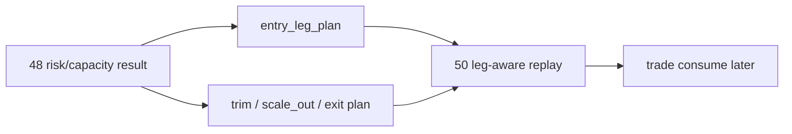

# position 分批进场、trim 与 partial-exit 合同冻结

`卡号`：`49`
`日期`：`2026-04-13`
`状态`：`待施工`

## 需求
- 问题：
  当前 `position` 虽已具备 versioned 的 MALF context sizing / batch contract，但退出与减仓仍停留在最小合同层，不足以承载中线波段交易。
- 目标结果：
  把 `entry / trim / scale-out / terminal-exit` 的计划腿合同补齐，为 `50` 的 leg-aware replay 与 `trade` 的后续只读消费建立稳定接口。
- 为什么现在做：
  `48` 已把 risk budget / capacity 真值厚账本冻结下来，如果不继续补齐 leg-aware 合同，`position` 仍会停在“只有 allowed weight、没有完整分腿计划”的中间状态。

## 设计输入
- 设计文档：
  `docs/01-design/modules/position/02-position-malf-context-driven-batched-management-charter-20260413.md`
- 规格文档：
  `docs/02-spec/modules/position/04-position-malf-context-driven-batched-management-spec-20260413.md`
- 上游结论：
  `docs/03-execution/48-position-risk-budget-and-capacity-ledger-hardening-conclusion-20260414.md`

## 任务分解
1. 冻结 `position_entry_leg_plan` 的正式多腿合同，使其能表达首批、确认加仓与延续加仓。
2. 升级 `position_exit_plan / position_exit_leg`，正式支持 `trim / scale_out / terminal_exit` 三类计划腿。
3. 把现有 `t+0 / t+1 / t+2 ...` 仅作为 `schedule_stage / schedule_lag_days` 参数化写入，而不是重定义原业务语义。
4. 明确 `partial-exit` 只在 `position` 层冻结计划腿与目标权重，不直接生成成交或 PnL 事实。
5. 为 `50` 的 leg-aware queue / replay / partial rematerialize 预留稳定自然键与冲突处理语义。

## 历史账本约束
- 实体锚点：`candidate_nk + leg_role + schedule_stage`
- 业务自然键：`entry_leg_nk / exit_plan_nk / exit_leg_nk`
- 批量建仓：支持对历史正式 `alpha formal signal` 回放生成全量进场腿与退出腿计划
- 增量更新：只对脏计划腿重物化，不影响未变化腿
- 断点续跑：本卡只冻结 leg-aware 语义与自然键，为 `50` 的 replay/resume 保留接口
- 审计账本：每条计划腿必须保留 `leg_gate_reason / schedule_stage / target_weight_after_leg / contract_version`

## A 级判定表

| 判定项 | A 级通过标准 | 不接受情形 | 交付物 |
| --- | --- | --- | --- |
| entry leg 正式合同 | `position_entry_leg_plan` 正式落表，支持首批、加仓与保留批次语义 | 继续只有单腿进场，或把多腿语义推迟到 `trade` | `position_entry_leg_plan` DDL 与字段契约 |
| exit leg 正式合同 | `position_exit_plan / position_exit_leg` 能表达 `trim / scale_out / terminal_exit` 三类正式计划腿 | 退出仍只有单条 exit plan，无法区分减仓与清仓 | `exit_plan / exit_leg` 升级后的正式语义 |
| 时间语义参数化 | `t+0 / t+1 / t+2 ...` 只作为 `schedule_stage / schedule_lag_days` 合同写入，不改写原系统语义 | 为适配实现而重定义 `t+n`，或把时间语义散落到 `trade` | schedule 字段与参数口径 |
| 计划腿自然键 | `entry_leg_nk / exit_plan_nk / exit_leg_nk` 可由 `candidate_nk + leg_role + schedule_stage + contract_version` 稳定复算 | 依赖临时序号、自增 id 或 run 顺序 | 自然键定义与冲突处理规则 |
| 批量与增量 | 历史回放可生成全量计划腿；增量模式只重物化脏腿 | 任一腿变化都要求整候选或整组合重跑 | replay / partial rematerialize 规则 |
| 与 trade 的边界 | `partial-exit` 只冻结计划腿与目标权重，不直接生成成交、PnL 或执行状态 | `position` 直接写 `trade` 或成交事实 | 边界说明与下游读取合同 |

## 图示

