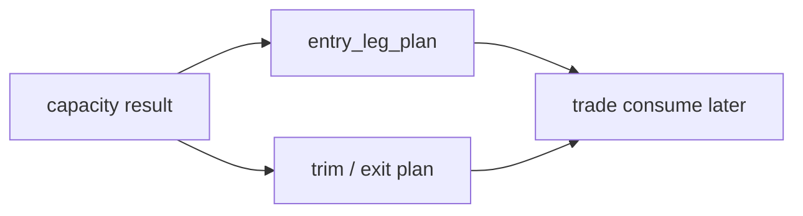

# position 分批进仓、trim 与 partial-exit 合同冻结

`卡号`：`49`
`日期`：`2026-04-13`
`状态`：`待施工`

## 问题

- 当前 `position` 只有单步 `target_weight / target_shares`，不适合中线波段交易。
- 用户已明确主线将走向“分批次进、分批次出”，但这必须先在 `position` 层冻结成计划事实，不能跳到 `trade` 再临时决定。

## 设计依据

- [02-position-malf-context-driven-batched-management-charter-20260413.md](/H:/lifespan-0.01/docs/01-design/modules/position/02-position-malf-context-driven-batched-management-charter-20260413.md)
- [04-position-malf-context-driven-batched-management-spec-20260413.md](/H:/lifespan-0.01/docs/02-spec/modules/position/04-position-malf-context-driven-batched-management-spec-20260413.md)

## 任务

1. 定义 `position_entry_leg_plan`。
2. 升级 `position_exit_plan / position_exit_leg`，支持 trim、scale-out、terminal-exit。
3. 把现有 `t+0 / t+1 / t+2 ...` 参数化进 schedule stage，而不是重定义。
4. 说明 `partial-exit` 只是在 `position` 层冻结计划腿，不直接生成成交。

## 历史账本约束

1. `实体锚点`
   - `candidate_nk + leg_role + schedule_stage`。
2. `业务自然键`
   - `entry_leg_nk / exit_plan_nk / exit_leg_nk`。
3. `批量建仓`
   - 对历史 signal 生成分批进入与退出计划。
4. `增量更新`
   - 仅对脏计划腿重物化。
5. `断点续跑`
   - 本卡定义 leg-aware 语义，为 `50` 的 replay 留接口。
6. `审计账本`
   - 每条计划腿必须记录 `leg_gate_reason / schedule_stage / target_weight_after_leg`。

## A 级判定表

| 判定项 | A 级通过标准 | 不接受情形 | 交付物 |
| --- | --- | --- | --- |
| entry leg 正式合同 | `position_entry_leg_plan` 正式落表，支持首批、加仓、保留批次语义 | 继续只有单腿进仓，或把多腿拆分推迟到 `trade` | `position_entry_leg_plan` DDL 与字段契约 |
| exit leg 正式合同 | `position_exit_plan / position_exit_leg` 能表达 trim、scale-out、terminal-exit 三类正式计划腿 | 退出仍只有单条 exit plan，无法区分减仓与清仓 | `exit_plan / exit_leg` 升级后的正式语义 |
| 时间语义参数化 | `t+0 / t+1 / t+2 ...` 仅作为 `schedule_stage` 和参数化约束写入计划腿，不改写原本业务语义 | 为了适配实现而重定义 `t+n`，或把时序语义散落在 trade 侧 | schedule stage 参数表与字段说明 |
| 计划腿自然键 | `entry_leg_nk / exit_plan_nk / exit_leg_nk` 可由 `candidate_nk + leg_role + schedule_stage + contract_version` 稳定复算 | 计划腿依赖临时序号、自增 id 或 run 顺序 | 自然键定义与冲突处理规则 |
| 批量与增量 | 历史回放可生成全量计划腿；增量模式只重物化脏腿，不影响未变化腿 | 任何一条腿变化都要求整候选甚至整组合重跑 | replay/partial rematerialize 规则 |
| 与 trade 的边界 | `partial-exit` 只冻结计划腿与目标权重，不直接生成成交、PnL 或执行状态 | `position` 直接写 `trade`、成交或执行事实 | 边界说明与下游读取契约 |

## 图示

