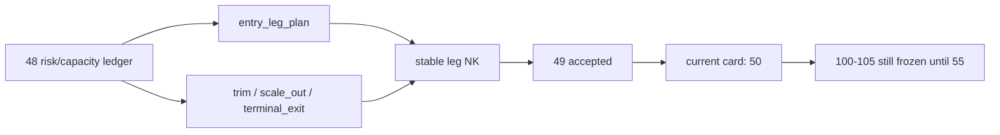

# position 分批进场、trim 与 partial-exit 合同冻结结论

结论编号：`49`
日期：`2026-04-14`
状态：`已完成`

## 裁决
- 接受：`position` 已完成 batched entry / trim / partial-exit leg-aware 合同冻结，`49` 正式收口，当前待施工卡前移到 `50`。
- 拒绝：本结论不等于 `50-55` 已完成，也不允许提前恢复 `100 -> 105`。

## 原因
1. `position_entry_leg_plan` 已维持正式三腿进场合同，并继续用稳定自然键表达首批、确认加仓与延续加仓。
2. `position_exit_plan / position_exit_leg` 已升级为可同时表达：
   - `trim`
   - `scale_out`
   - `terminal_exit`
   三类正式计划腿
3. `exit_leg_nk` 已从 `seq` 主语义收敛为 `candidate_nk + leg_role + schedule_stage + contract_version`。
4. `position_policy_registry` 已把激活合同前移到 `position-malf-batched-entry-exit-v2`，确保 `49` 的新腿合同以版本化方式进入正式账本。
5. 单元测试与路径治理检查已证明：
   - `scale_out` 双腿计划可以稳定落表
   - `trim / terminal_exit` 旧路径未回归
   - 本卡没有引入新的 `position` 路径治理违规

## 影响
1. 当前最新生效结论锚点推进到 `49-position-batched-entry-trim-and-partial-exit-contract-conclusion-20260414.md`。
2. 当前待施工卡前移到 `50-position-data-grade-checkpoint-and-replay-runner-card-20260413.md`。
3. `50 -> 55` 继续作为进入 `trade` 前的前置卡组推进。
4. `100 -> 105` 仍冻结到 `55` 接受之后。

## 六条历史账本约束检查
| 项目 | 当前状态 | 说明 |
| --- | --- | --- |
| 实体锚点 | 已满足 | 计划腿锚点正式收敛为 `candidate_nk + leg_role + schedule_stage`。 |
| 业务自然键 | 已满足 | `entry_leg_nk / exit_plan_nk / exit_leg_nk` 均可由业务字段稳定复算，不依赖 `run_id` 或 `seq`。 |
| 批量建仓 | 已满足 | `materialize_position_from_formal_signals` 可对正式 `alpha formal signal` 回放生成 entry / trim / scale_out / terminal-exit 计划腿。 |
| 增量更新 | 已声明 | 本卡已把 leg-aware NK、冲突语义与计划 bundle 冻结为正式合同；dirty queue / partial rematerialize 仍由 `50` 交付。 |
| 断点续跑 | 已声明 | `49` 不越界实现 `work_queue / checkpoint`，但已为 `50` 保留稳定的 leg-aware replay 接口。 |
| 审计账本 | 已满足 | `leg_gate_reason / schedule_stage / target_weight_after_leg / contract_version` 已进入正式计划腿账本。 |

## 结论结构图

