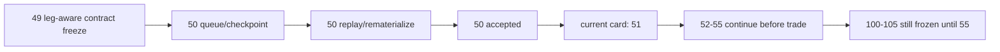

# position data-grade checkpoint 与 replay runner 结论

结论编号：`50`
日期：`2026-04-14`
状态：`已完成`

## 裁决

- 接受：`position` 已具备官方库、`work_queue / checkpoint / replay / rematerialize` 的 data-grade runner 能力，`50` 正式收口。
- 拒绝：本结论不等于 `51-55` 已完成，也不允许提前恢复 `100 -> 105`。

## 原因

1. `position_work_queue / position_checkpoint / position_run_snapshot` 已进入正式 `position.duckdb` 表族，且自然键不依赖 `run_id`。
2. 同一 runner 现在同时支持：
   - 历史 bounded replay
   - 默认 checkpoint queue 续跑
   - 单候选 rematerialize
3. `position_run / position_run_snapshot` 已能稳定区分：
   - `inserted`
   - `reused`
   - `rematerialized`
4. 受控 smoke 已证明：
   - 首轮 queue 会 bootstrap queue/checkpoint 并完成插入
   - 第二轮 queue 会跳过未变化历史
   - 参考价变化会触发 bounded rematerialize，并把新价格回写到正式 sizing 事实

## 影响

1. 当前最新生效结论锚点推进到 `50-position-data-grade-checkpoint-and-replay-runner-conclusion-20260414.md`。
2. 当前待施工卡前移到 `51-pre-portfolio-plan-position-acceptance-gate-card-20260413.md`。
3. `51 -> 55` 继续作为进入 `trade` 前的前置卡组。
4. `100 -> 105` 仍冻结到 `55` 接受之后。

## 六条历史账本约束检查

| 项目 | 当前状态 | 说明 |
| --- | --- | --- |
| 实体锚点 | 已满足 | `asset_type + code` 继续体现在候选来源，runner 控制面锚点冻结为 `candidate_nk`。 |
| 业务自然键 | 已满足 | `queue_nk / checkpoint_nk / candidate_nk` 均可由业务字段稳定复算。 |
| 批量建仓 | 已满足 | 显式 bounded replay 可对历史 `alpha formal signal` 回放生成完整 `position` 表族。 |
| 增量更新 | 已满足 | 默认 queue 模式可跳过未变化历史，并对脏候选局部挂账。 |
| 断点续跑 | 已满足 | `position_work_queue + position_checkpoint` 已支持 resume 与局部 replay/rematerialize。 |
| 审计账本 | 已满足 | `position_run / position_run_snapshot` 已落表 `inserted / reused / rematerialized`。 |

## 结论结构图

