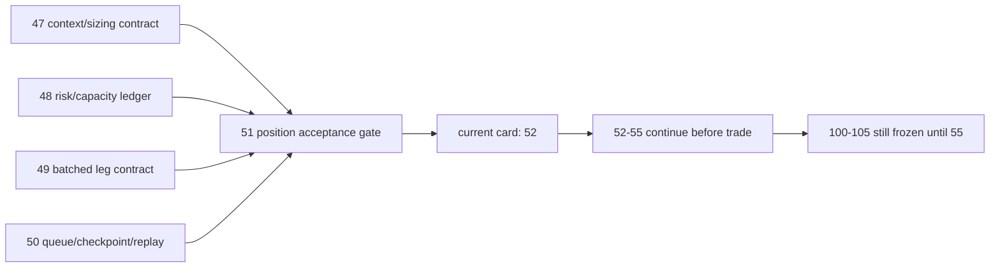

# 进入 portfolio_plan 前的 position acceptance gate 结论

结论编号：`51`
日期：`2026-04-14`
状态：`已完成`

## 裁决

- 接受：`position` 已达到进入 `portfolio_plan` 前的 `A` 级 acceptance gate，`52 -> 55` 现可只读消费正式 `position` 账本继续推进。
- 拒绝：本结论不等于 `52-55` 已完成，也不允许提前恢复 `100 -> 105`。

## 原因

1. `47` 已冻结 MALF context 驱动的仓位与分批合同。
   - `context_behavior_profile / deployment_stage / context_weight_rule_code` 已成为正式账本字段
   - `t+0 / t+1 / t+2 ...` 已收敛为参数化 schedule 合同
2. `48` 已冻结 risk budget 与 capacity 厚账本。
   - `risk budget / context cap / single-name cap / portfolio cap / final allowed weight` 已可逐层解释
   - `binding_cap_code` 已能回答最终权重由哪一层 cap 绑定
3. `49` 已冻结 batched entry / trim / partial-exit 计划腿。
   - `entry_leg_nk / exit_plan_nk / exit_leg_nk` 均可由业务字段稳定复算
   - `position` 仍停留在计划层，不越界生成 `trade` 执行事实
4. `50` 已把 `position` 升级为带 `work_queue / checkpoint / replay / rematerialize` 的 data-grade runner。
   - 受控 smoke 已证明 queue bootstrap、skip unchanged history 与 bounded rematerialize 三条事实链
   - `position_run / position_run_snapshot` 已能稳定审计 `inserted / reused / rematerialized`
5. 当前复核再次证明 `position` 已具备进入 `portfolio_plan` 的正式准入质量。
   - `tests/unit/position` 重新通过
   - 执行索引、doc-first 与路径治理检查全部通过

## 影响

1. 当前最新生效结论锚点推进到 `51-pre-portfolio-plan-position-acceptance-gate-conclusion-20260414.md`。
2. 当前待施工卡前移到 `52-portfolio-plan-official-ledger-family-and-natural-key-freeze-card-20260413.md`。
3. `52 -> 55` 继续作为进入 `trade` 前的前置卡组推进。
4. `100 -> 105` 仍冻结到 `55` 接受之后。

## 六条历史账本约束检查

| 项目 | 当前状态 | 说明 |
| --- | --- | --- |
| 实体锚点 | 已满足 | `asset_type + code` 继续经 `candidate_nk` 绑定到 `position` 全部正式候选、风险、容量、计划腿与 checkpoint 控制面。 |
| 业务自然键 | 已满足 | `candidate_nk / risk_budget_snapshot_nk / capacity_snapshot_nk / sizing_snapshot_nk / entry_leg_nk / exit_plan_nk / exit_leg_nk / checkpoint_nk` 均可稳定复算。 |
| 批量建仓 | 已满足 | bounded replay 已可从正式 `alpha formal signal` 回放出完整 `position` 厚账本与计划腿。 |
| 增量更新 | 已满足 | `source fingerprint + work_queue` 已支持跳过未变化历史并对脏候选局部挂账。 |
| 断点续跑 | 已满足 | `position_work_queue + position_checkpoint` 已支持默认 queue 续跑与局部 replay/rematerialize。 |
| 审计账本 | 已满足 | `position_run / position_run_snapshot` 与 `51` 的 evidence / record / conclusion 已形成可追溯验收链。 |

## 结论结构图

