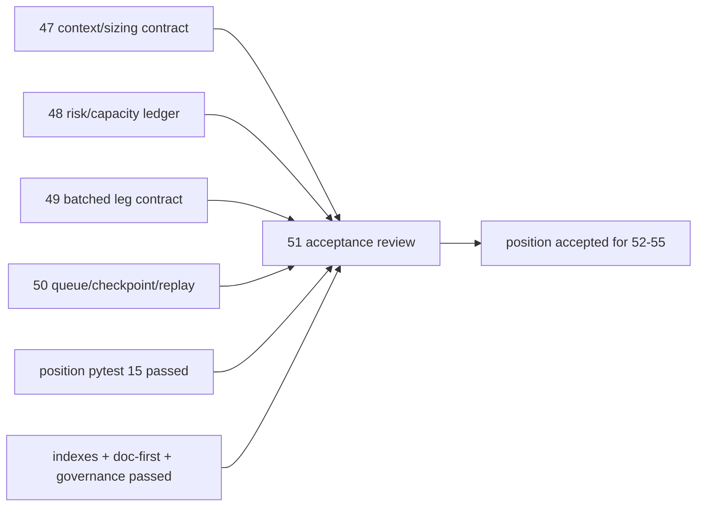

# 进入 portfolio_plan 前的 position acceptance gate 证据

证据编号：`51`
日期：`2026-04-14`

## 上游结论汇总证据

1. `47-position-malf-context-driven-sizing-and-batch-contract-conclusion-20260414.md`
   - 已冻结 `malf_context_4 + lifecycle -> context_behavior_profile + deployment_stage + context_weight_rule_code` 的正式映射。
   - 已把 `t+0 / t+1 / t+2 ...` 进场与退出 schedule 收敛为正式合同字段，而不是运行时隐式分支。
2. `48-position-risk-budget-and-capacity-ledger-hardening-conclusion-20260414.md`
   - 已正式落表 `position_risk_budget_snapshot`，并把 `risk budget / context cap / single-name cap / portfolio cap / final allowed weight` 拆成可审计厚账本。
   - 已用 `binding_cap_code` 固定最终权重被哪一层 cap 绑定。
3. `49-position-batched-entry-trim-and-partial-exit-contract-conclusion-20260414.md`
   - 已冻结 `entry / trim / scale_out / terminal_exit` 的计划腿合同。
   - `exit_leg_nk` 已收敛为 `candidate_nk + leg_role + schedule_stage + contract_version`，不再依赖 `seq` 或 `run_id`。
4. `50-position-data-grade-checkpoint-and-replay-runner-conclusion-20260414.md`
   - 已把 `position_work_queue / position_checkpoint / position_run_snapshot` 纳入正式表族。
   - 已证明同一 runner 同时支持 bounded replay、默认 queue 续跑与单候选 rematerialize。
5. `50-position-data-grade-checkpoint-and-replay-runner-evidence-20260414.md`
   - 受控 smoke 已证明首轮 queue 插入、第二轮 queue 跳过未变化历史、第三轮 bounded rematerialize 回写新参考价三条事实链。

## 当前复核命令证据

1. `python -m pytest tests/unit/position -q --basetemp H:\Lifespan-temp\pytest-tmp\position-51a`
   - 结果：`15 passed in 24.86s`
2. `python .codex/skills/lifespan-execution-discipline/scripts/check_execution_indexes.py --include-untracked`
   - 结果：`conclusion / evidence / card / records / reading-order / completion-ledger` 全部通过
3. `python scripts/system/check_doc_first_gating_governance.py`
   - 结果：通过；当前待施工卡 `51-pre-portfolio-plan-position-acceptance-gate-card-20260413.md` 已具备需求、设计、规格、任务分解与历史账本约束
4. `python scripts/system/check_development_governance.py docs/03-execution/00-conclusion-catalog-20260409.md docs/03-execution/A-execution-reading-order-20260409.md docs/03-execution/B-card-catalog-20260409.md docs/03-execution/C-system-completion-ledger-20260409.md docs/03-execution/51-pre-portfolio-plan-position-acceptance-gate-card-20260413.md docs/03-execution/50-position-data-grade-checkpoint-and-replay-runner-conclusion-20260414.md docs/03-execution/50-position-data-grade-checkpoint-and-replay-runner-evidence-20260414.md docs/03-execution/50-position-data-grade-checkpoint-and-replay-runner-record-20260414.md docs/03-execution/47-position-malf-context-driven-sizing-and-batch-contract-conclusion-20260414.md docs/03-execution/48-position-risk-budget-and-capacity-ledger-hardening-conclusion-20260414.md docs/03-execution/49-position-batched-entry-trim-and-partial-exit-contract-conclusion-20260414.md`
   - 结果：通过；本卡涉及的执行索引与文档文件没有引入新的治理违规

## Acceptance 判定表

| 判定对象 | 判定结果 | 证据锚点 |
| --- | --- | --- |
| `47` 上下文驱动仓位合同 | 通过 | `context_behavior_profile / deployment_stage / context_weight_rule_code` 已进入正式账本 |
| `48` risk/capacity 厚账本 | 通过 | `position_risk_budget_snapshot` 与 `binding_cap_code` 已可审计 |
| `49` 分批进入/退出计划腿 | 通过 | `entry_leg_nk / exit_leg_nk` 已按计划腿语义冻结 |
| `50` data-grade runner | 通过 | `work_queue / checkpoint / replay / rematerialize` 已有 smoke 与单测证据 |
| `position` 整体 acceptance | 通过 | `47-50` 主合同闭环且当前单测、索引、治理检查均通过 |

## 证据结构图

