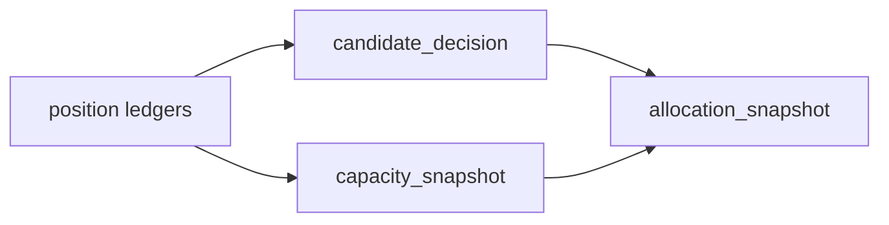

# portfolio_plan 官方账本族与自然键冻结卡

`卡号`：`52`
`日期`：`2026-04-13`
`状态`：`待施工`

## 目标

冻结 `portfolio_plan` 从最小三表到官方组合裁决账本族的升级合同。

## 依赖

- [02-portfolio-plan-official-ledger-family-and-capacity-charter-20260413.md](/H:/lifespan-0.01/docs/01-design/modules/portfolio_plan/02-portfolio-plan-official-ledger-family-and-capacity-charter-20260413.md)
- [02-portfolio-plan-official-ledger-family-and-capacity-spec-20260413.md](/H:/lifespan-0.01/docs/02-spec/modules/portfolio_plan/02-portfolio-plan-official-ledger-family-and-capacity-spec-20260413.md)

## 任务

1. 冻结 `portfolio_plan_candidate_decision / capacity_snapshot / allocation_snapshot` 表族。
2. 冻结 `portfolio_id` 实体锚点与各类业务自然键。
3. 明确 `snapshot` 是聚合兼容层，不再承担唯一主语义。

## 历史账本约束

1. `实体锚点`
   - `portfolio_id`
2. `业务自然键`
   - `candidate_nk + portfolio_id + reference_trade_date + plan_contract_version`
3. `批量建仓`
   - 支持 `portfolio_id + date window + candidate slice`
4. `增量更新`
   - position dirty 与组合配置变更共同驱动
5. `断点续跑`
   - 后续由 `54` 补齐 queue/checkpoint/replay
6. `审计账本`
   - `portfolio_plan_run / run_snapshot / summary_json`

## A 级判定表

| 判定项 | A 级通过标准 | 不接受情形 | 交付物 |
| --- | --- | --- | --- |
| 官方账本族冻结 | `portfolio_plan_candidate_decision / capacity_snapshot / allocation_snapshot` 成为正式主语义，`snapshot` 只保留聚合兼容层职责 | 继续让 `snapshot` 独占主语义，或缺少中间正式账本 | DDL、字段契约与下游消费口径 |
| 实体锚点与自然键 | `portfolio_id` 为组合锚点，各 ledger 以 `candidate_nk + portfolio_id + reference_trade_date + contract_version` 等业务字段稳定复算 | 使用 `run_id`、窗口、导出文件名替代自然键 | 自然键表与 upsert 规则 |
| position 上游边界 | `portfolio_plan` 只读消费正式 `position` 候选/容量/计划腿账本，不回读内部 helper | 组合层仍需访问 `position` 私有过程或临时 DataFrame | 上游输入清单 |
| 批量建仓切片 | 支持 `portfolio_id + date window + candidate slice` 的组合账本初始化 | 只能整组合全历史重跑 | bootstrap 切片契约 |
| 增量挂脏接口 | 明确 position dirty 与组合配置变化如何映射到组合层业务自然键 | 仍完全依赖上游隐式传播，组合层没有自己的主语义单元 | dirty 触发清单 |
| 下游可消费性 | `trade` 未来可只读消费正式组合账本族，而无需重新计算 admitted/blocked/trimmed | 下游仍需在 trade 中二次裁决组合结果 | trade 输入合同草案 |

## 图示

