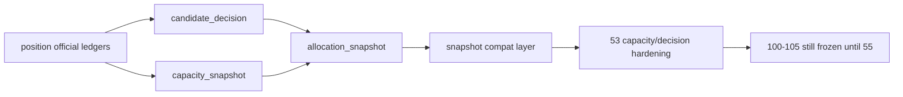

# portfolio_plan 官方账本族与自然键冻结结论

结论编号：`52`
日期：`2026-04-14`
状态：`已完成`

## 裁决

- 接受：`portfolio_plan_candidate_decision / portfolio_plan_capacity_snapshot / portfolio_plan_allocation_snapshot` 已成为 `portfolio_plan` 的官方主语义账本层。
- 接受：`portfolio_id` 组合锚点与三类业务自然键已经冻结，`run_id` 继续只承担审计职责。
- 接受：`portfolio_plan_snapshot` 已退回兼容聚合层，不再独占组合业务真值。
- 拒绝：把 `52` 表述成 `53-55` 已完成，或据此提前恢复 `100-105`。

## 原因

1. `bootstrap` 已把 `portfolio_plan` 表族升级到 `v2` 官方账本清单。
   - `run / work_queue / checkpoint / candidate_decision / capacity_snapshot / allocation_snapshot / snapshot / run_snapshot / freshness_audit`
   - 既有 `run / snapshot / run_snapshot` 也已补齐兼容列
2. `runner` 已按正式主语义先落 `candidate_decision / capacity_snapshot / allocation_snapshot`，再回写兼容 `snapshot`。
   - `capacity` 以 `reference_trade_date` 为日切片独立计算
   - `snapshot` 显式挂接三类自然键，不再自行承担唯一主语义
3. 三类业务自然键已经可由业务字段稳定复算。
   - `candidate_decision_nk = candidate_nk + portfolio_id + reference_trade_date + plan_contract_version`
   - `capacity_snapshot_nk = portfolio_id + capacity_scope + reference_trade_date + plan_contract_version`
   - `allocation_snapshot_nk = candidate_nk + portfolio_id + allocation_scene + reference_trade_date + plan_contract_version`
4. 单测与治理检查共同证明本卡已形成正式闭环。
   - `tests/unit/portfolio_plan` 已通过
   - `compileall / doc-first / development governance` 已通过

## 影响

1. 当前最新生效结论锚点推进到 `52-portfolio-plan-official-ledger-family-and-natural-key-freeze-conclusion-20260414.md`。
2. 当前待施工卡前移到 `53-portfolio-plan-capacity-decision-ledger-hardening-card-20260413.md`。
3. `54-55` 继续保持待施工；`100-105` 仍冻结到 `55` 接受之后。

## 六条历史账本约束检查

| 项目 | 当前状态 | 说明 |
| --- | --- | --- |
| 实体锚点 | 已满足 | `portfolio_id` 已固定为组合主锚点。 |
| 业务自然键 | 已满足 | `candidate_decision_nk / capacity_snapshot_nk / allocation_snapshot_nk` 均可稳定复算。 |
| 批量建仓 | 已满足 | 当前 runner 已支持 `portfolio_id + date window + candidate slice` 的 bounded 回放。 |
| 增量更新 | 部分满足 | 官方表族已预留 `work_queue / checkpoint / freshness_audit`，正式 data-grade 增量语义留待 `54` 收口。 |
| 断点续跑 | 部分满足 | 断点控制面表已冻结，但 queue/replay/resume 的正式行为仍待 `54` 完成。 |
| 审计账本 | 已满足 | `portfolio_plan_run / portfolio_plan_run_snapshot / 52 evidence / record / conclusion` 已形成可追溯闭环。 |

## 结论结构图

