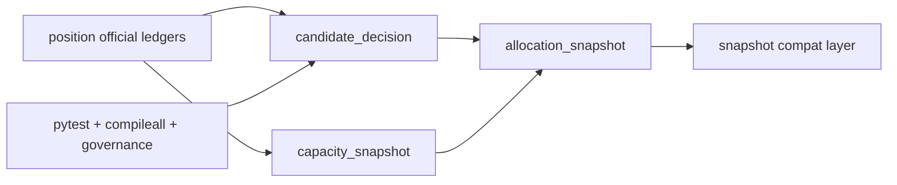

# portfolio_plan 官方账本族与自然键冻结证据

证据编号：`52`
日期：`2026-04-14`

## 实现与验证命令

1. `python -m pytest tests/unit/portfolio_plan -q --basetemp H:\Lifespan-temp\pytest-tmp\portfolio-plan-52`
   - 结果：`5 passed in 4.86s`
   - 覆盖点：
     - `bootstrap` 已创建 `portfolio_plan_run / work_queue / checkpoint / candidate_decision / capacity_snapshot / allocation_snapshot / snapshot / run_snapshot / freshness_audit`
     - `runner` 已正式物化 `candidate_decision / capacity_snapshot / allocation_snapshot`
     - `snapshot` 已退回兼容聚合层，并显式挂接三类 v2 自然键
     - `inserted / reused / rematerialized` 已继续可审计
2. `python -m compileall src/mlq/portfolio_plan tests/unit/portfolio_plan`
   - 结果：通过
   - 说明：`bootstrap.py / materialization.py / runner.py` 与对应单测文件均能正常编译
3. `python scripts/system/check_development_governance.py src/mlq/portfolio_plan/bootstrap.py src/mlq/portfolio_plan/materialization.py src/mlq/portfolio_plan/runner.py src/mlq/portfolio_plan/__init__.py tests/unit/portfolio_plan/test_bootstrap.py tests/unit/portfolio_plan/test_runner.py`
   - 结果：通过
   - 说明：本次改动范围没有超出 1000 行硬上限，也没有引入新的中文治理或仓库卫生违规
4. `python scripts/system/check_doc_first_gating_governance.py`
   - 结果：通过
   - 说明：当前待施工卡 `52-portfolio-plan-official-ledger-family-and-natural-key-freeze-card-20260413.md` 具备需求、设计、规格、任务分解与历史账本约束

## 冻结事实

1. `portfolio_plan_candidate_decision`
   - 自然键已冻结为 `candidate_nk + portfolio_id + reference_trade_date + plan_contract_version`
2. `portfolio_plan_capacity_snapshot`
   - 自然键已冻结为 `portfolio_id + capacity_scope + reference_trade_date + plan_contract_version`
3. `portfolio_plan_allocation_snapshot`
   - 自然键已冻结为 `candidate_nk + portfolio_id + allocation_scene + reference_trade_date + plan_contract_version`
4. `portfolio_plan_snapshot`
   - 已保留兼容聚合层职责，并显式引用 `candidate_decision_nk / capacity_snapshot_nk / allocation_snapshot_nk`

## 证据结构图

