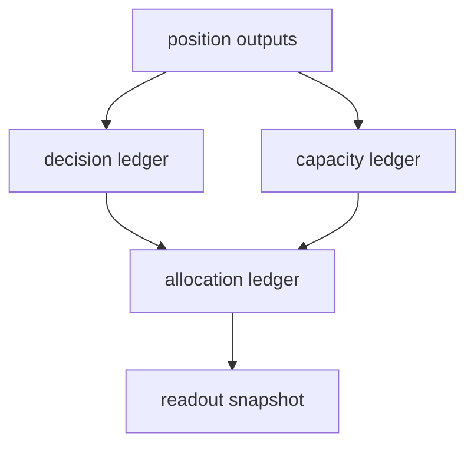

# portfolio_plan 容量与裁决账本硬化卡

`卡号`：`53`
`日期`：`2026-04-13`
`状态`：`待施工`

## 目标

把 `portfolio_plan` 从最小 admitted/blocked/trimmed 结果，升级为足以支撑下游消费的厚账本。

## 依赖

- [02-portfolio-plan-official-ledger-family-and-capacity-charter-20260413.md](/H:/lifespan-0.01/docs/01-design/modules/portfolio_plan/02-portfolio-plan-official-ledger-family-and-capacity-charter-20260413.md)
- [02-portfolio-plan-official-ledger-family-and-capacity-spec-20260413.md](/H:/lifespan-0.01/docs/02-spec/modules/portfolio_plan/02-portfolio-plan-official-ledger-family-and-capacity-spec-20260413.md)

## 任务

1. 补齐组合层 admitted / blocked / trimmed / deferred 裁决账本。
2. 补齐容量占用、剩余和裁减原因的正式物化。
3. 保证 `trade` 将来可直接消费 `portfolio_plan` 正式输出。

## 历史账本约束

1. `实体锚点`
   - `portfolio_id`
2. `业务自然键`
   - `capacity_scope + reference_trade_date + portfolio_id`
3. `批量建仓`
   - 分组合、分日期、分候选回放
4. `增量更新`
   - 候选变更或容量合同变更触发
5. `断点续跑`
   - 后续由 `54` 接入 data-grade runner
6. `审计账本`
   - `run_snapshot` 明确 `inserted / reused / rematerialized`

## A 级判定表

| 判定项 | A 级通过标准 | 不接受情形 | 交付物 |
| --- | --- | --- | --- |
| 裁决厚账本 | admitted / blocked / trimmed / deferred 均有正式 decision ledger，且每条裁决有原因码和来源容量约束 | 仍只有最终 admitted/blocked 结果，无法解释 deferred/trimmed | decision ledger 与 reason code |
| 容量厚账本 | 容量占用、剩余、裁减来源、组合级限制均有正式 ledger，可追溯到候选层 | 容量事实只存在于汇总列或临时函数返回值 | capacity ledger 与读数字段 |
| allocation 主语义 | `allocation_snapshot` 成为 trade 的直接上游读数，而非聊天解释或 report 导出 | trade 仍需自行重算 allocation | allocation ledger 与消费合同 |
| 自然键稳定 | `capacity_scope + reference_trade_date + portfolio_id` 等键可稳定复算、可 upsert | 依赖批次顺序或 run 粒度判断唯一性 | 主键、唯一键与 rematerialize 规则 |
| 批量与增量 | 支持分组合、分日期、分候选回放；局部候选变化只重物化受影响 ledger | 任一候选变化导致整组合全量重算 | bootstrap / incremental 规则 |
| 审计可解释 | `run_snapshot` 与 summary 能解释 inserted/reused/rematerialized 对应到哪类 decision/capacity 变化 | 审计只剩 run 级计数，无法解释业务影响 | run_snapshot、summary 字段与测试 |

## 图示

