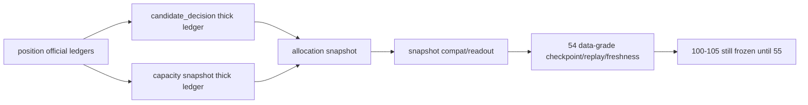

# portfolio_plan 容量与裁决账本硬化结论

结论编号：`53`
日期：`2026-04-14`
状态：`已完成`

## 裁决

- 接受：`portfolio_plan_candidate_decision / capacity_snapshot / allocation_snapshot` 已从最小 admitted/blocked 结果升级为可解释的厚账本层。
- 接受：组合层 `admitted / blocked / trimmed / deferred` 已全部具备正式 reason code、排序位次、容量前后读数与 trade readiness 语义。
- 接受：`portfolio_plan_capacity_snapshot` 已正式沉淀容量占用、剩余、裁减来源与原因汇总，足以支撑后续 `54-55`。
- 拒绝：把 `53` 表述成 `54-55` 已完成，或据此提前恢复 `100-105`。

## 原因

1. `bootstrap` 已为 `portfolio_plan` 官方表族补齐 `53` 所需厚账本列。
   - `candidate_decision` 已补齐 `decision_rank / decision_order_code / trade_readiness_status / capacity_before_weight / capacity_after_weight`
   - `capacity_snapshot` 已补齐五类候选计数与权重、`binding_constraint_code / capacity_decision_reason_code / capacity_reason_summary_json`
   - `allocation_snapshot / snapshot / run_snapshot` 已补齐 `decision_reason_code / schedule_stage / trade_readiness_status`
2. `runner` 已把组合层排序、容量解释与延后语义正式物化。
   - 当前正式排序规则冻结为 `requested_weight desc -> instrument -> candidate_nk`
   - `schedule_stage / schedule_lag_days` 未到交易窗口的候选，正式落为 `deferred`
   - `position` 上游 `blocked_reason_code / binding_cap_code / capacity_source_code / required_reduction_weight` 已正式透传进组合层账本
3. `capacity_reason_summary_json` 已形成组合层厚解释出口。
   - 可回答每个交易日有哪些候选被 `trimmed / blocked / deferred`
   - 可回答绑定约束与 decision reason 的聚合分布
4. 单测与治理检查共同证明本卡已形成正式闭环。
   - `tests/unit/portfolio_plan` 已通过
   - `compileall / doc-first / development governance` 已通过

## 影响

1. 当前最新生效结论锚点推进到 `53-portfolio-plan-capacity-decision-ledger-hardening-conclusion-20260414.md`。
2. 当前待施工卡前移到 `54-portfolio-plan-data-grade-checkpoint-replay-and-freshness-card-20260413.md`。
3. `55` 继续保持待施工；`100-105` 仍冻结到 `55` 接受之后。

## 六条历史账本约束检查

| 项目 | 当前状态 | 说明 |
| --- | --- | --- |
| 实体锚点 | 已满足 | `portfolio_id` 继续作为组合层唯一稳定锚点。 |
| 业务自然键 | 已满足 | `candidate_decision_nk / capacity_snapshot_nk / allocation_snapshot_nk` 继续由业务字段稳定复算。 |
| 批量建仓 | 已满足 | 当前 runner 已支持按 `portfolio_id + reference_trade_date window + candidate slice` 分批回放，并保持排序与裁减结果稳定。 |
| 增量更新 | 部分满足 | 容量原因、排序与延后语义已冻结到正式账本列；正式 `work_queue / checkpoint / replay / freshness` 仍待 `54` 收口。 |
| 断点续跑 | 部分满足 | 本卡不越界实现 data-grade runner，但已把 `54` 需要消费的 decision/capacity 厚账本语义全部固定。 |
| 审计账本 | 已满足 | `portfolio_plan_run / run_snapshot / 53 evidence / record / conclusion` 已形成可追溯闭环。 |

## 结论结构图

