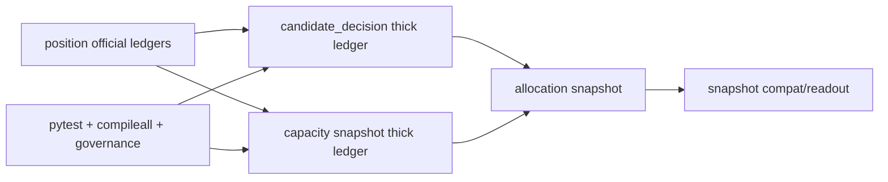

# portfolio_plan 容量与裁决账本硬化证据

证据编号：`53`
日期：`2026-04-14`

## 实现与验证命令

1. `python -m pytest tests/unit/portfolio_plan -q --basetemp H:\Lifespan-temp\pytest-tmp\portfolio-plan-53`
   - 结果：`5 passed in 4.90s`
   - 覆盖点：
     - `candidate_decision` 已正式落下 `decision_rank / decision_order_code / trade_readiness_status / capacity_before_weight / capacity_after_weight`
     - `capacity_snapshot` 已正式落下 `requested/admitted/blocked/trimmed/deferred` 计数与权重、`binding_constraint_code`、`capacity_reason_summary_json`
     - `allocation_snapshot / snapshot` 已显式挂接 `decision_reason_code / decision_rank / trade_readiness_status / schedule_stage`
     - `deferred` 已由正式组合层账本承接，不再退化成临时解释
2. `python -m compileall src/mlq/portfolio_plan tests/unit/portfolio_plan`
   - 结果：通过
   - 说明：`bootstrap.py / materialization.py / runner.py` 与 `portfolio_plan` 单测文件均可正常编译
3. `python scripts/system/check_development_governance.py src/mlq/portfolio_plan/bootstrap.py src/mlq/portfolio_plan/materialization.py src/mlq/portfolio_plan/runner.py src/mlq/portfolio_plan/__init__.py tests/unit/portfolio_plan/test_bootstrap.py tests/unit/portfolio_plan/test_runner.py`
   - 结果：通过
   - 说明：本次改动范围未触发新的中文治理、仓库卫生或文件长度硬违规；`runner.py` 已压回 800 行目标线以内
4. `python scripts/system/check_doc_first_gating_governance.py`
   - 结果：通过
   - 说明：当前待施工卡 `53-portfolio-plan-capacity-decision-ledger-hardening-card-20260413.md` 已具备需求、设计、规格、任务分解与历史账本约束

## 冻结事实

1. `portfolio_plan_candidate_decision`
   - 已显式回答 `admitted / blocked / trimmed / deferred`
   - 每条裁决已挂接 `decision_reason_code / decision_rank / trade_readiness_status`
   - 已透传 `source_binding_cap_code / source_capacity_source_code / source_required_reduction_weight`
2. `portfolio_plan_capacity_snapshot`
   - 已显式记录组合层 `requested / admitted / blocked / trimmed / deferred` 的计数与权重
   - 已冻结 `binding_constraint_code / capacity_decision_reason_code / capacity_reason_summary_json`
3. `portfolio_plan_allocation_snapshot`
   - 已成为 `trade` 未来可直接消费的组合计划读数层
   - 已显式记录 `decision_reason_code / decision_rank / schedule_stage / trade_readiness_status`
4. `portfolio_plan_snapshot`
   - 继续只承担兼容聚合与 readout 职责
   - 已显式回挂 `decision / capacity / allocation` 厚账本字段

## 证据结构图

