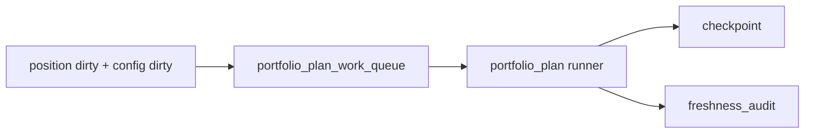

# portfolio_plan data-grade checkpoint、replay 与 freshness 卡

`卡号`：`54`
`日期`：`2026-04-13`
`状态`：`待施工`

## 目标

把 `portfolio_plan` runner 从 bounded pilot 升级为 data-grade runner。

## 依赖

- [03-portfolio-plan-data-grade-runner-and-freshness-charter-20260413.md](/H:/lifespan-0.01/docs/01-design/modules/portfolio_plan/03-portfolio-plan-data-grade-runner-and-freshness-charter-20260413.md)
- [03-portfolio-plan-data-grade-runner-and-freshness-spec-20260413.md](/H:/lifespan-0.01/docs/02-spec/modules/portfolio_plan/03-portfolio-plan-data-grade-runner-and-freshness-spec-20260413.md)

## 任务

1. 补齐 `portfolio_plan_work_queue / checkpoint / freshness_audit`。
2. 补齐 bootstrap / incremental / replay 三种运行模式。
3. 在 `H:\Lifespan-data` 上形成正式组合层续跑语义。

## 历史账本约束

1. `实体锚点`
   - `portfolio_id`
2. `业务自然键`
   - `portfolio_id + candidate_nk + reference_trade_date`
3. `批量建仓`
   - 支持分片初始化
4. `增量更新`
   - position dirty + capacity dirty
5. `断点续跑`
   - `work_queue + checkpoint + replay/resume`
6. `审计账本`
   - `run / run_snapshot / freshness_audit`

## A 级判定表

| 判定项 | A 级通过标准 | 不接受情形 | 交付物 |
| --- | --- | --- | --- |
| 官方本地 ledger | `run_portfolio_plan_build.py` 升级后继续固定写入 `WorkspaceRoots -> H:\\Lifespan-data` 的正式组合账本 | 使用 shadow DB、临时库或 report 导出物反向充当主库 | runner 路径契约与落库 smoke |
| work queue | `portfolio_plan_work_queue` 具备 `portfolio_id + candidate/capacity dirty` 的正式挂账语义 | 仍只有隐式 dirty 传播，没有正式 queue 表 | `portfolio_plan_work_queue` DDL 与挂脏规则 |
| checkpoint | `portfolio_plan_checkpoint` 能记录组合级最近完成边界，并支持跳过未变化组合窗口 | 没有 checkpoint，或 checkpoint 仍依赖 run 粒度 | `portfolio_plan_checkpoint` DDL 与更新规则 |
| replay/resume | 支持只重放指定 queue 范围、组合窗口或 rematerialized 候选，不重跑全历史 | replay 退化成 bounded full rebuild | replay 参数与行为说明 |
| freshness audit | `portfolio_plan_freshness_audit` 能给出 `latest / expected / freshness_status / last_success_run_id` | 组合层没有 freshness 读数，无法作为 trade 正式上游 | freshness_audit DDL 与审计口径 |
| smoke 与 acceptance | 至少通过官方库 smoke、checkpoint/resume smoke、replay smoke、freshness smoke | 只有单元测试，没有真实 runner 证据 | evidence 命令与 acceptance 读数 |

## 图示

