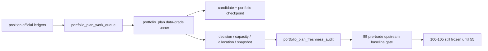

# portfolio_plan data-grade checkpoint / replay / freshness 结论
`结论编号`：`54`
`日期`：`2026-04-14`
`状态`：`已完成`

## 裁决

- 接受：`portfolio_plan` 已从 bounded pilot 升级为正式 data-grade runner，具备独立 `work_queue / checkpoint / replay / freshness_audit`。
- 接受：`incremental` 与 `replay` 已不再退化成整段历史全量重跑；命中候选会扩展到同交易日全量上下文，保证组合容量裁决保持一致。
- 接受：`portfolio_plan_freshness_audit` 已能给出 `latest / expected / freshness_status / last_success_run_id`，足以支撑 `55` 的 pre-trade baseline gate。
- 拒绝：把 `54` 表述成 `55` 已完成，或据此提前恢复 `100-105`。

## 原因

1. `bootstrap` 已补齐 `54` 所需正式字段
   - `portfolio_plan_run` 追加 `execution_mode` 与 queue/checkpoint/freshness 审计计数
   - `portfolio_plan_work_queue` 追加 `checkpoint_nk / source_fingerprint / source_run_id / claimed/completed` 字段
   - `portfolio_plan_checkpoint / portfolio_plan_freshness_audit / portfolio_plan_run_snapshot` 已补齐 `54` 所需列
2. `runner` 已形成三种正式运行模式
   - `bootstrap`：用于按窗口或切片建仓
   - `incremental`：默认围绕 source fingerprint 判脏、挂账、claim、续跑
   - `replay`：允许显式重放 queue/candidate/date scope，而不是重跑全历史
3. 组合层容量联动已按正式语义落地
   - 候选被 queue 命中时，会扩展到同 `reference_trade_date` 的完整候选集合重算
   - 这样可以保证 `capacity_snapshot / candidate_decision / allocation_snapshot / snapshot` 不会因为局部 replay 失真
4. freshness 读数已被单测证明可用
   - 全量追平时为 `fresh`
   - partial claim 时为 `stale`
5. 单测、编译与治理检查共同证明本卡已形成正式闭环
   - `tests/unit/portfolio_plan` 通过
   - `compileall / development governance / doc-first gating / execution indexes` 通过

## 影响

1. 当前最新生效结论锚点推进到 `54-portfolio-plan-data-grade-checkpoint-replay-and-freshness-conclusion-20260414.md`。
2. 当前待施工卡前移到 `55-pre-trade-upstream-data-grade-baseline-gate-card-20260413.md`。
3. `100-105` 继续冻结到 `55` 接受之后。

## 六条历史账本约束检查
| 项目 | 当前状态 | 说明 |
| --- | --- | --- |
| 实体锚点 | 已满足 | `portfolio_id` 继续作为组合层唯一稳定锚点。 |
| 业务自然键 | 已满足 | `candidate_decision_nk / capacity_snapshot_nk / allocation_snapshot_nk / queue_nk` 均由业务字段稳定复算。 |
| 批量建仓 | 已满足 | `bootstrap` 支持按 `portfolio_id + reference_trade_date window + candidate slice` 分批建仓。 |
| 增量更新 | 已满足 | `incremental` 已围绕 source fingerprint 判脏并写入正式 `work_queue`。 |
| 断点续跑 | 已满足 | `candidate checkpoint + portfolio checkpoint + replay` 已形成正式续跑语义。 |
| 审计账本 | 已满足 | `portfolio_plan_run / work_queue / checkpoint / run_snapshot / freshness_audit` 已形成可追溯审计闭环。 |

## 结论结构图

