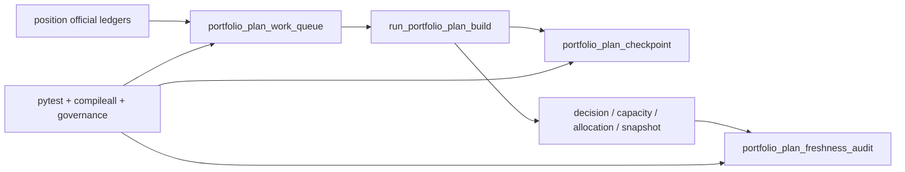

# portfolio_plan data-grade checkpoint / replay / freshness 证据
`证据编号`：`54`
`日期`：`2026-04-14`

## 实现与验证命令

1. `python -m pytest tests/unit/portfolio_plan -q --basetemp H:\Lifespan-temp\pytest-tmp\portfolio-plan-54`
   - 结果：`6 passed in 6.28s`
   - 覆盖点：
     - `bootstrap` 保持 `53` 的厚裁决账本语义不回退
     - `incremental` 正式写入 `portfolio_plan_work_queue / checkpoint / freshness_audit`
     - `replay` 命中候选后会扩展到同交易日全量上下文，保证容量裁决不失真
     - `freshness` 能在 partial claim 时给出 `stale` 读数
2. `python -m compileall src/mlq/portfolio_plan tests/unit/portfolio_plan`
   - 结果：通过
   - 说明：`bootstrap.py / runner.py / scripts/portfolio_plan/run_portfolio_plan_build.py / tests/unit/portfolio_plan/test_runner.py` 可正常编译
3. `python scripts/system/check_development_governance.py src/mlq/portfolio_plan/bootstrap.py src/mlq/portfolio_plan/runner.py src/mlq/portfolio_plan/__init__.py scripts/portfolio_plan/run_portfolio_plan_build.py tests/unit/portfolio_plan/test_runner.py`
   - 结果：通过
   - 说明：本次新增的 data-grade runner、CLI 入口与单测未引入新的治理违规
4. `python scripts/system/check_doc_first_gating_governance.py`
   - 结果：通过
   - 说明：当前待施工卡在收口前已具备 `design / spec / card` 前置文档
5. `python .codex/skills/lifespan-execution-discipline/scripts/check_execution_indexes.py --include-untracked`
   - 结果：通过
   - 说明：`54` 的 evidence / record / conclusion 与执行索引已形成闭环

## 冻结事实

1. `portfolio_plan_run`
   - 已正式记录 `execution_mode`
   - 已正式记录 `queue_enqueued_count / queue_claimed_count / checkpoint_upserted_count / freshness_updated_count`
2. `portfolio_plan_work_queue`
   - 已冻结为 `portfolio_id + candidate_nk + reference_trade_date` 粒度的正式挂账表
   - 已正式落下 `checkpoint_nk / queue_reason / source_fingerprint / claimed/completed` 审计字段
3. `portfolio_plan_checkpoint`
   - 已同时覆盖 `candidate` 粒度续跑与 `portfolio_gross` 组合级最近完成边界
   - 已正式沉淀 `last_completed_reference_trade_date / last_completed_candidate_nk / checkpoint_payload_json`
4. `portfolio_plan_freshness_audit`
   - 已正式给出 `latest / expected / freshness_status / last_success_run_id`
   - 已证明 partial incremental claim 会把未追平窗口标记为 `stale`

## 证据结构图

