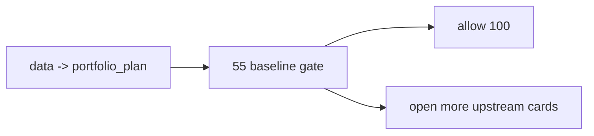

# pre-trade upstream data-grade baseline gate 卡

`卡号`：`55`
`日期`：`2026-04-13`
`状态`：`待施工`

## 目标

在进入 `100` 前，裁决 `data -> portfolio_plan` 是否已经达到全 A 质量基线。

## 依赖

- [16-pre-trade-upstream-data-grade-baseline-gate-charter-20260413.md](/H:/lifespan-0.01/docs/01-design/modules/system/16-pre-trade-upstream-data-grade-baseline-gate-charter-20260413.md)
- [16-pre-trade-upstream-data-grade-baseline-gate-spec-20260413.md](/H:/lifespan-0.01/docs/02-spec/modules/system/16-pre-trade-upstream-data-grade-baseline-gate-spec-20260413.md)

## 任务

1. 逐模块裁决 `data -> portfolio_plan` 的 A/B/C 等级。
2. 显式检查自然键、批量建仓、增量、checkpoint/replay、freshness、正式库路径。
3. 只有通过后才允许恢复 `100-105`。

## 历史账本约束

1. `实体锚点`
   - 按各模块正式锚点检查
2. `业务自然键`
   - 按各模块正式自然键检查
3. `批量建仓`
   - 各模块都要给出正式策略
4. `增量更新`
   - 各模块都要给出正式策略
5. `断点续跑`
   - 各模块都要具备正式策略
6. `审计账本`
   - evidence / record / conclusion + 模块级审计账本

## A 级分级规则

| 等级 | 判定标准 | 对 `55` 的影响 |
| --- | --- | --- |
| `A` | 正式 `H:\\Lifespan-data` 落表、稳定实体锚点、稳定自然键、批量建仓、日更增量、`work_queue + checkpoint + replay/resume`、freshness audit、模块级审计全部闭环 | 可放行 |
| `A-acceptance` | 主链合同已满足 `trade` 恢复前提，仅剩展示性或非主链 sidecar 欠账，不影响自然键、增量、续跑、freshness | 可放行，但必须在 conclusion 显式挂账 |
| `B` | 已有正式 ledger，但批量建仓、增量、queue/checkpoint/replay、freshness 任一未闭环 | 不可放行 |
| `C` | 仍停留在 bounded skeleton、私有过程或临时汇总层 | 不可放行 |

## 模块 A 级判定表

| 模块 | 当前起点（2026-04-13） | 达到 A 的硬条件 | 绑定卡 |
| --- | --- | --- | --- |
| `data` | `A` | 维持官方 ledger inventory、bootstrap/incremental/replay/freshness 全闭环，不回退 shadow DB | `39 / 40` |
| `malf` | `A` | 维持 pure semantic core、canonical queue/checkpoint、只读 sidecar 边界 | `29 / 30 / 36` |
| `structure` | `B+` | canonical 主线、正式 queue/checkpoint/replay、official smoke、仅只读消费 sidecar | `43 / 44` |
| `filter` | `B+` | canonical 主线、正式 queue/checkpoint/replay、official smoke、严格 pre-trigger 边界 | `43 / 44` |
| `alpha` | `B` | trigger/family/formal signal 账本、queue/checkpoint/rematerialize、正式 signal 输出合同稳定 | `43 / 45` |
| `position` | `C+` | 上下文驱动仓位合同、risk/capacity 厚账本、分批计划腿、data-grade runner、official smoke | `47 / 48 / 49 / 50 / 51` |
| `portfolio_plan` | `C+` | 官方账本族、decision/capacity 厚账本、独立 queue/checkpoint/replay/freshness、official smoke | `52 / 53 / 54` |

## Gate 通过条件

| 判定项 | 通过标准 | 阻断条件 |
| --- | --- | --- |
| 主链范围 | `data -> portfolio_plan` 全部达到 `A` 或 `A-acceptance` | 任一模块仍为 `B/C` |
| 自然键与正式库 | 所有模块主语义可稳定复算，且正式写入 `H:\\Lifespan-data` | 仍使用临时库、shadow DB、私有 DataFrame |
| 批量与增量 | 每个模块都能回答 bootstrap 与 daily incremental | 任一模块只能靠全量重跑 |
| 续跑与 replay | 每个模块都具备正式 `work_queue + checkpoint + replay/resume` | 任一模块缺 queue/checkpoint 或 replay 不可解释 |
| freshness audit | 每个模块都能给出 freshness 读数或等价 acceptance 读数 | 任一模块无 freshness/audit 落点 |
| 恢复 `100-105` | 只有本表全部通过，才允许恢复 `trade/system` 卡组 | 任何阻断项成立即继续开 upstream 卡 |

## 图示

