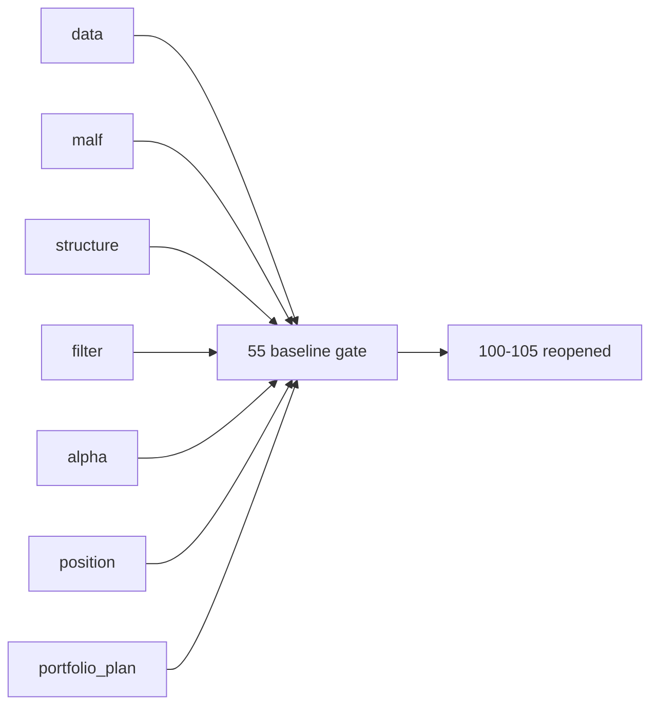

# pre-trade upstream data-grade baseline gate 结论
`结论编号`：`55`
`日期`：`2026-04-14`
`状态`：`已完成`

## 裁决

- 接受：`data -> malf -> structure -> filter -> alpha -> position -> portfolio_plan` 已形成统一的 data-grade baseline，`55` 可以放行。
- 接受：`portfolio_plan` 已不再停留在 bounded skeleton，而是具备独立 `work_queue / checkpoint / replay / freshness_audit` 的正式 data-grade runner。
- 接受：`55` 通过后，`100-105` 可以恢复为正式施工卡组。
- 拒绝：把 `55` 误解为 `trade/system` 已经进入 live orchestration 或 broker runtime。

## 原因

1. `data` 已完成正式历史账本化。
   - `39 / 40` 已把本地官方 ledger 标准化与增量同步 / resume 口径固定下来
   - `data` 的正式写入口径仍然只落在官方 `raw_market / market_base` 历史账本
2. `malf` 已完成纯语义冻结与 canonical runner 收口。
   - `29 / 30 / 36` 已把 canonical core、数据级 runner 和 wave life sidecar 的边界固定下来
   - `malf` 不再承载高周期动作接口或交易建议
3. `structure / filter / alpha` 已完成 upstream baseline 的只读消费合同。
   - `43 / 44` 已把 `structure` 与 `filter` 收束到 canonical mainline 与 official replay hardening
   - `41 / 45` 已把 `alpha` 固化为正式 signal producer，不再回读 bridge-era 临时过程
4. `position` 已完成 data-grade runner 与 acceptance gate。
   - `47 / 48 / 49 / 50 / 51` 已把上下文驱动仓位、risk/capacity 厚账本、分批计划腿与 checkpoint/replay 收口
   - `position` 已能稳定为 `portfolio_plan` 提供只读正式输入
5. `portfolio_plan` 已完成最后一段 upstream data-grade 收口。
   - `52 / 53 / 54` 已冻结官方账本族、容量决策厚账本、checkpoint / replay / freshness
   - 当前 `portfolio_plan` 可作为 `55` 的最后裁决输入，且不再依赖临时 DataFrame 或私有 helper 过程

## 模块 A 级判定表

| 模块 | 结论锚点 | 判定 |
| --- | --- | --- |
| `data` | `39 / 40` | `A` |
| `malf` | `29 / 30 / 36` | `A` |
| `structure` | `43 / 44` | `A` |
| `filter` | `43 / 44` | `A` |
| `alpha` | `41 / 45` | `A` |
| `position` | `47 / 48 / 49 / 50 / 51` | `A` |
| `portfolio_plan` | `52 / 53 / 54` | `A` |

## 影响

1. 当前最新生效结论锚点推进到 `55-pre-trade-upstream-data-grade-baseline-gate-conclusion-20260414.md`。
2. 当前待施工卡前移到 `100-trade-signal-anchor-contract-freeze-card-20260411.md`。
3. `100-105` 从 `55` 之后恢复为正式施工卡组。
4. `55` 之后的主线仍然保持正式账本纪律，不把 `trade` 提前提升为 live runtime。

## 六条历史账本约束检查

| 项目 | 当前状态 | 说明 |
| --- | --- | --- |
| 实体锚点 | 已满足 | `asset_type + code`、`portfolio_id` 等稳定锚点在各模块中已冻结，`run_id` 继续只承担审计职责。 |
| 业务自然键 | 已满足 | 各模块自然键已由业务字段稳定复算，不依赖临时导出或批次名。 |
| 批量建仓 | 已满足 | `data -> portfolio_plan` 的正式批量建仓 / 切片 / 回放合同已在前序结论中固定。 |
| 增量更新 | 已满足 | 各模块已具备正式增量账本或等价的局部更新语义。 |
| 断点续跑 | 已满足 | `work_queue + checkpoint + replay/resume` 已在 `position / portfolio_plan` 形成正式续跑语义，前序模块也已完成对应收口。 |
| 审计账本 | 已满足 | 各模块的 evidence / record / conclusion 与执行索引已形成可追溯闭环。 |

## 结论结构图

